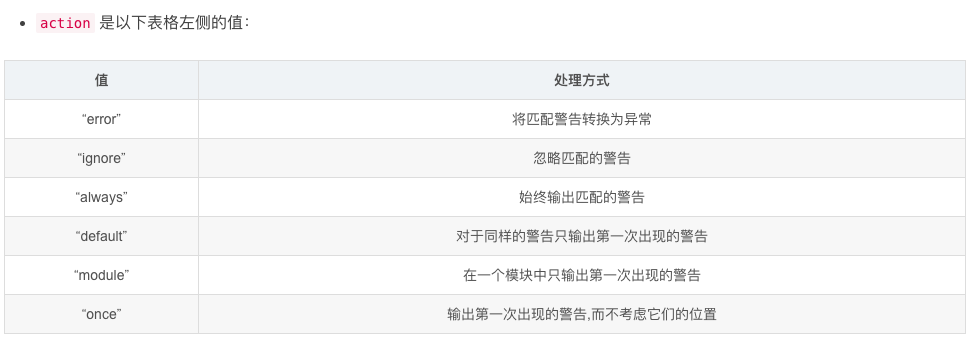

### Day01

### 一、matplotlib理论介绍

1.Matplotlib是一个 Python 的 2D绘图库；

2.主要绘图：折线图、条状(柱状)图、饼图、散点图、雷达图、直方图、箱图、功率图等等；

 3.它以各种硬拷贝格式和跨平台的交互式环境生成出版质量级别的图形，图片清晰度可以调节；

4.具有良好的操作系统兼容性和图形显示底层接口兼容性。Matplotlib支持几十种图形显示接口与输出格式，跨平台、面面俱到的特定已经成为Matplotlib最强大的功能之一。

5.运行地方：Python Shell、IPython Shell、Jupyter Notebook、Web；

6.核心对象：就是尺寸对象，plt.pyplot在绘制图片时会自动创建一个Figure对象，会产生相应的画布；

#### 图表的构成

1.标题；2.图例；3.XY轴标签；4.XY轴刻度；  5.图形；  6.图形标签；

### 二、绘图代码演示

```python
import numpy as np
import scipy.stats as stats#比numpy多了一个库、数

import matplotlib.style as style
import matplotlib.pyplot as plt
#嵌入，静态图像
%matplotlib inline
#背景版风格设置
style.use('fivethirtyeight')
#字体 清晰度 figure身材，你给长宽尺寸全局设置
plt.rcParams['figure.figsize'] = (14,7)
plt.rcParams['figure.dpi'] = 100
#图形部分
X = np.linspace(-4,4,100)
y = stats.norm.pdf(X) / np.max(stats.norm.pdf(X))

plt.plot(X,y,label='PDF') 
plt.fill_between(X,y,alpha=.3)

plt.plot(X,stats.norm.cdf(X),label='CDF')
#图例#调用
plt.legend() 

#图片上文字的说明
plt.text(x=-1.3,y=.7,s='pdf',rotation=65,alpha=.75,weight='bold',size=20,color='#000FFF')
plt.text(x=.35,y=.5,s='cdf',rotation=55,alpha=.75,weight='bold',size=20,color='#FC4000')

#标题
plt.title('Demo')
#X，Y轴的标签
plt.xlabel('X',color='r')
plt.ylabel('f(x)=exp(-x^2)/(2x)',color='r')
#设置刻度
plt.axis([-2,2,0,1.2])
#保存图片dpi清晰度
plt.savefig('./pdf.png',dpi=100)
```


##### 各种函数详解

##### 1.numpy

NumPy(Numerical Python) 是 Python 语言的一个扩展程序库，支持大量的维度数组与矩阵运算，此外也针对数组运算提供大量的数学函数库。NumPy 是一个运行速度非常快的数学库，主要用于数组计算，包含：

- 一个强大的N维数组对象 ndarray
- 广播功能函数
- 整合 C/C++/Fortran 代码的工具
- 线性代数、傅里叶变换、随机数生成等功能

##### 2.Scipy

是一个开源的 Python 算法库和数学工具包。SciPy函数库在NumPy库的基础上增加了众多的数学、科学以及工程计算中常用的库函数。SciPy 包含的模块有最优化、线性代数、积分、插值、特殊函数、快速傅里叶变换、信号处理和图像处理、稀疏矩阵、常微分方程求解和其他科学与工程中常用的计算；

Spicy.stats是统计函数库；所有统计函数都位于子包 **scipy.stats** 中；

[参考：Scipy函数库的应用及实例](https://www.jianshu.com/p/be1252b0059e)

##### 3.matplotlib

Matplotlib 是 Python 编程语言及其数值数学扩展包 NumPy 的可视化操作界面。它为利用通用的图形用户界面工具包，如 Tkinter, wxPython, Qt 或 GTK+ 向应用程序嵌入式绘图提供了应用程序接口（API）。

[matplotlib官网](https://matplotlib.org/)

[Matplotlib 教程·菜鸟教程](https://www.runoob.com/w3cnote/matplotlib-tutorial.html)

##### 4.matplotlib.style

使用matplotlib画图的时候，除了我们可以针对每一个样式自己定义以外，我们还可以使用系统定义好的样式快速配置。style是pyplot的一个子模块，方便进行风格转换，它里面定义了很多预设风格。本质上来说，每一个预设的风格style都是一个style文件，它是以 .mplstyle  为后缀的文件。

##### 5.matplotlib.pyplot：

matplotlib.pyplot：提供一个类似matlab的绘图框架。

[Matplotlib.pyplot 常用方法](https://www.cnblogs.com/shaosks/p/9849446.html)

##### 6.%matplotlib作用

是在使用jupyter notebook 或者 jupyter qtconsole的时候，才会经常用到%matplotlib，也就是说那一份代码可能就是别人使用jupyter notebook 或者 jupyter qtconsole进行编辑的。而%matplotlib具体作用是当你调用matplotlib.pyplot的绘图函数plot()进行绘图的时候，或者生成一个figure画布的时候，可以直接在你的python console里面生成图像。

**inline**： 内嵌方式，无需执行plt.show()
**notebook**: 交互方式，用户能对图像进行操作

https://www.jianshu.com/p/2dda5bb8ce7d

[[%matplotlib inline的含义]](https://www.cnblogs.com/chester-cs/p/11825282.html)

##### 7.plt.style

```python
import numpy as np
import matplotlib.pyplot as plt
import matplotlib as mpl
plt.style.use('dark_background') 
np.random.seed(1)
data = np.random.randn(50)
plt.plot(data)
plt.show()
```


```python
#查看多少个可用的style
·>> print(len(plt.style.available))
·>> print(plt.style.available)

·26
·['seaborn-dark', 'seaborn-darkgrid', 'seaborn-ticks', 'fivethirtyeight', 'seaborn-whitegrid', 'classic', '_classic_test', 'fast', 'seaborn-talk', 'seaborn-dark-palette', 'seaborn-bright', 'seaborn-pastel', 'grayscale', 'seaborn-notebook', 'ggplot', 'seaborn-colorblind', 'seaborn-muted', 'seaborn', 'Solarize_Light2', 'seaborn-paper', 'bmh', 'tableau-colorblind10', 'seaborn-white', 'dark_background', 'seaborn-poster', 'seaborn-deep']
```

[浅谈在matplotlib中更改plt.plot()的绘图风格](https://blog.csdn.net/qq_42505705/article/details/84962815)

##### 8.plt.rcParams(设置图像细节)

pylot使用rc配置文件来自定义图形的各种默认属性，称之为rc配置或rc参数。通过rc参数可以修改默认的属性，包括窗体大小、每英寸的点数、线条宽度、颜色、样式、坐标轴、坐标和网络属性、文本、字体等。rc参数存储在字典变量中，通过字典的方式进行访问。

figure.figsize:图像显示大小

figure.dpi：图像分辨率


[plt.rcParams属性说明](https://blog.csdn.net/weixin_39010770/article/details/88200298)

##### 9.np.linspace

主要用来创建等差数列。从-4到4造100个数；

```python
np.linspace参数：
numpy.linspace(start, stop, num=50, endpoint=True, retstep=False, dtype=None, axis=0)
Return evenly spaced numbers over a specified interval.
(在start和stop之间返回均匀间隔的数据)
Returns num evenly spaced samples, calculated over the interval [start, stop].
(返回的是 [start, stop]之间的均匀分布)
The endpoint of the interval can optionally be excluded.
Changed in version 1.16.0: Non-scalar start and stop are now supported.
(可以选择是否排除间隔的终点)

参数含义：
start:返回样本数据开始点
stop:返回样本数据结束点
num:生成的样本数据量，默认为50
endpoint：True则包含stop；False则不包含stop
retstep：If True, return (samples, step), where step is the spacing between samples.(即如果为True则结果会给出数据间隔)
dtype：输出数组类型
axis：0(默认)或-1

使用例子：
>>> np.linspace(2.0, 3.0, num=5)
array([ 2.  ,  2.25,  2.5 ,  2.75,  3.  ])
>>> np.linspace(2.0, 3.0, num=5, endpoint=False)
array([ 2. ,  2.2,  2.4,  2.6,  2.8])
>>> np.linspace(2.0, 3.0, num=5, retstep=True)
(array([ 2.  ,  2.25,  2.5 ,  2.75,  3.  ]), 0.25)
```

##### 10.numpy.exp

np.exp(B) : 求e的幂次方;

np.sqrt(B):求B的开方;


##### 10.scipy.stats.norm

scipy.stats.norm函数可以实现正态分布（也就是高斯分布）

**pdf(x, loc=0, scale=1)**：输入x，返回概率密度函数

pdf : 概率密度函数；

标准形式是：


```
norm.pdf(x, loc, scale)`
等同于
`norm.pdf(y) / scale ，其中 y = (x - loc) / scale
```

```python
import numpy as np
from scipy.stats import norm
import matplotlib.pyplot as plt
from matplotlib import style
style.use('fivethirtyeight')

fig = plt.figure(figsize=(10, 10))
ax = fig.add_subplot(111)
np.random.seed(0)

X = np.linspace(-5, 5, num=20)

# 第一种调用方式
gauss = norm(loc=1, scale=2)  # loc: mean 均值， scale: standard deviation 标准差
r_1 = gauss.pdf(X)

# 第二种调用方式
r_2 = norm.pdf(X, loc=0, scale=2)

for i in range(len(X)):
    ax.scatter(X[i], 0, s=100)
for g, c in zip([r_1, r_2], ['r', 'g']):  # 'r': red, 'g':green
    ax.plot(X, g, c=c)
plt.show()
```


[代码参考](http://www.freesion.com/article/452412206/)

[scipy.stats 规范](https://docs.scipy.org/doc/scipy/reference/generated/scipy.stats.norm.html?highlight=norm)

**stats.norm.cdf**

cdf(x, loc=0, scale=1)；输入x，返回概率，既密度函数的面积；

##### 11.np.max和np.maximum

np.max(a, axis=None, out=None, keepdims=False)   

求序列的最值，最少接受一个参数，axis默认为axis=0即列向,如果axis=1即横向；

```python
·>> np.max([-2, -1, 0, 1, 2])
·2
```

np.maximum(X, Y, out=None)

X和Y逐位进行比较,选择最大值.最少接受两个参数

```python
·>> np.maximum([-3, -2, 0, 1, 2], 0)
·array([0, 0, 0, 1, 2])
```

[代码参考](https://www.cnblogs.com/logo-88/p/9265015.html)

##### 12.plt.plot

**plt.plot(x,y,format_string,\**kwargs)**
说明：

- x:x轴数据，列表或数组，可选
- y:y轴数据，列表或数组
- format_string:控制曲线的格式字符串，可选
- **kwargs:第二组或更多，(x,y,format_string)

调用的形式，将y对x绘制为线条和/或标记，告诉你我给你这些数据，要画了；

label：图例标签

[[matplotlib.pyplot.plot ]](https://matplotlib.org/api/_as_gen/matplotlib.pyplot.plot.html#matplotlib.pyplot.plot)

[matplotlib.pyplot.plot()参数详解](https://blog.csdn.net/sinat_36219858/article/details/79800460?depth_1-utm_source=distribute.pc_relevant.none-task&utm_source=distribute.pc_relevant.none-task)

[Matplotlib系列---pyplot的plot( )函数](https://blog.csdn.net/skyli114/article/details/77508136?depth_1-utm_source=distribute.pc_relevant.none-task&utm_source=distribute.pc_relevant.none-task)

##### 13.fill_between

函数间区域填充，两函数间的Y轴方向的填充；

alpha：覆盖区域的透明度[0,1],其值越大，表示越不透明

```python
import numpy as np
import matplotlib.pyplot as plt
x = np.linspace(0, 5 * np.pi, 1000)
y1 = np.sin(x)
y2 = np.sin(2 * x)
plt.fill(x, y1, color="g", alpha=0.3)
plt.fill(x, y2, color="b", alpha=0.3)
plt.show()
```


[基于matplotlib的数据可视化（图形填充fill fill_between）](https://blog.csdn.net/weixin_34248118/article/details/86006720?depth_1-utm_source=distribute.pc_relevant.none-task&utm_source=distribute.pc_relevant.none-task)

[Matplotlib中的fill_between总结](https://blog.csdn.net/kabuto_hui/article/details/84979606)

##### 14.plt.legend()

显示图例；函数主要的作用就是给图加上图例;

##### 15.plt.text()函数用于设置文字说明

x，y   坐标

s:字符串，文字

rotation参数是和水平坐标轴的夹角。

alpha:透明度

weight：注释文本内容的粗细风格

size:表示字体大小

color：字颜色

```python
import matplotlib.pyplot as plt

fig = plt.figure()
plt.axis([0, 10, 0, 10])
t = "This is a really long string that I'd rather have wrapped so that it"\
    " doesn't go outside of the figure, but if it's long enough it will go"\
    " off the top or bottom!"
plt.text(4, 1, t, ha='left', rotation=15, wrap=True)
plt.text(6, 5, t, ha='left', rotation=15, wrap=True)
plt.text(6, 5, t, ha='left', rotation=15, wrap=False)
plt.show()
```


[plt.text()函数解析（最清晰的解释）](https://blog.csdn.net/TeFuirnever/article/details/88947248)

##### 16.plt.title()函数用于设置图像标题

plt.xlabel()：x轴标签文本

plt.ylabel()：y轴标签文本

```python
import matplotlib.pyplot as plt

x=[1,2,3,4,5]
y=[3,6,7,9,2]
 
fig,ax=plt.subplots(1,1)
plt.title('Interesting Graph') 
ax.plot(x,y,label='trend')
plt.show()
```


[plt.title()函数解析（最清晰的解释）](https://blog.csdn.net/TeFuirnever/article/details/88945563)

##### 17.plt.axis

就是设置坐标范围的,超出坐标范围的点不会被画出来！

plt.axis([-1, 2, -1, 1])#x轴范围[-1,2] ,y轴范围[-1,1]

```python
import matplotlib.pyplot as plt 
import numpy as np
x=np.arange(-5,5,0.01)
y=x**3 
plt.axis([-4,4,-10,10])
plt.plot(x,y)
plt.show()
```


[Python学习笔记(matplotlib篇)-坐标轴范围](https://www.cnblogs.com/linblogs/p/9642472.html)

##### 18.plt.savefig()

##### 保存图片

### 三、交互方式的图形绘制代码

##### 1.numpy

NumPy(Numerical Python) 是 Python 语言的一个扩展程序库，支持大量的维度数组与矩阵运算，此外也针对数组运算提供大量的数学函数库。NumPy 是一个运行速度非常快的数学库，主要用于数组计算，包含：

- 一个强大的N维数组对象 ndarray
- 广播功能函数
- 整合 C/C++/Fortran 代码的工具
- 线性代数、傅里叶变换、随机数生成等功能

##### 2.Scipy

是一个开源的 Python 算法库和数学工具包。SciPy函数库在NumPy库的基础上增加了众多的数学、科学以及工程计算中常用的库函数。SciPy 包含的模块有最优化、线性代数、积分、插值、特殊函数、快速傅里叶变换、信号处理和图像处理、稀疏矩阵、常微分方程求解和其他科学与工程中常用的计算；

Spicy.stats是统计函数库；所有统计函数都位于子包 **scipy.stats** 中；

[参考：Scipy函数库的应用及实例](https://www.jianshu.com/p/be1252b0059e)

##### 3.matplotlib

Matplotlib 是 Python 编程语言及其数值数学扩展包 NumPy 的可视化操作界面。它为利用通用的图形用户界面工具包，如 Tkinter, wxPython, Qt 或 GTK+ 向应用程序嵌入式绘图提供了应用程序接口（API）。

[matplotlib官网](https://matplotlib.org/)

[Matplotlib 教程·菜鸟教程](https://www.runoob.com/w3cnote/matplotlib-tutorial.html)

##### 4.matplotlib.style

使用matplotlib画图的时候，除了我们可以针对每一个样式自己定义以外，我们还可以使用系统定义好的样式快速配置。style是pyplot的一个子模块，方便进行风格转换，它里面定义了很多预设风格。本质上来说，每一个预设的风格style都是一个style文件，它是以 .mplstyle  为后缀的文件。

##### 5.matplotlib.pyplot：

matplotlib.pyplot：提供一个类似matlab的绘图框架。

[Matplotlib.pyplot 常用方法](https://www.cnblogs.com/shaosks/p/9849446.html)

##### 6.warnings

Python 通过调用 warnings 模块中定义的 warn() 函数来发出警告。


```python
#我们可以通过警告过滤器进行控制是否发出警告消息，
import warnings
warnings.filterwarnings('ignore')
#这样就可以忽略警告消息了。下面来函数解析一下：
warnings.filterwarnings(action, 
						message='', 
						category=Warning, 
						module='', 
						lineno=0, 
						append=False)
```

过滤警告，在 警告过滤器规则 列表中插入一个条目。默认情况下，条目插入在前面；如果 append 为真，则在末尾插入。它检查参数的类型，编译 message 和 module 的正则表达式，并将它们作为警告过滤器列表中的元组插入。如果多个地方都匹配特定的警告，那么更靠近列表前面的条目会覆盖列表中后面的条目，省略的参数默认为匹配一切的值。

- `message` 是包含正则表达式的字符串，警告消息的开始必须匹配，不区分大小写
- `category` 是一个警告类型（必须是 Warning 的子类）
- `module` 是包含模块名称的正则表达式字符串，区分大小写
- `lineno` 是一个整数，警告发生的行号，为 0 则匹配所有行号

action 是以下表格左侧的值：

[warnings.filterwarnings("ignore")代码解析](https://blog.csdn.net/tefuirnever/article/details/94122670)

[warnings.filterwarnings("ignore")代码解析](https://blog.csdn.net/tefuirnever/article/details/94122670)

[Python 模块简介 -- warnings](http://blog.konghy.cn/2017/12/16/python-warnings/#filterwarnings)

##### 7.%matplotlib作用

是在使用jupyter notebook 或者 jupyter qtconsole的时候，才会经常用到%matplotlib，也就是说那一份代码可能就是别人使用jupyter notebook 或者 jupyter qtconsole进行编辑的。而%matplotlib具体作用是当你调用matplotlib.pyplot的绘图函数plot()进行绘图的时候，或者生成一个figure画布的时候，可以直接在你的python console里面生成图像。

**inline**： 内嵌方式，无需执行plt.show()
**notebook**: 交互方式，用户能对图像进行操作

https://www.jianshu.com/p/2dda5bb8ce7d

[[%matplotlib inline的含义]](https://www.cnblogs.com/chester-cs/p/11825282.html)

##### 8.plt.style

```python
import numpy as np
import matplotlib.pyplot as plt
import matplotlib as mpl
plt.style.use('dark_background') 
np.random.seed(1)
data = np.random.randn(50)
plt.plot(data)
plt.show()
```


```python
#查看多少个可用的style
·>> print(len(plt.style.available))
·>> print(plt.style.available)

·26
·['seaborn-dark', 'seaborn-darkgrid', 'seaborn-ticks', 'fivethirtyeight', 'seaborn-whitegrid', 'classic', '_classic_test', 'fast', 'seaborn-talk', 'seaborn-dark-palette', 'seaborn-bright', 'seaborn-pastel', 'grayscale', 'seaborn-notebook', 'ggplot', 'seaborn-colorblind', 'seaborn-muted', 'seaborn', 'Solarize_Light2', 'seaborn-paper', 'bmh', 'tableau-colorblind10', 'seaborn-white', 'dark_background', 'seaborn-poster', 'seaborn-deep']
```

[浅谈在matplotlib中更改plt.plot()的绘图风格](https://blog.csdn.net/qq_42505705/article/details/84962815)

##### 9.plt.rcParams(设置图像细节)

pylot使用rc配置文件来自定义图形的各种默认属性，称之为rc配置或rc参数。通过rc参数可以修改默认的属性，包括窗体大小、每英寸的点数、线条宽度、颜色、样式、坐标轴、坐标和网络属性、文本、字体等。rc参数存储在字典变量中，通过字典的方式进行访问。


plt.rcParams['font.family']=['']

[【超简单超清楚】mac环境matplotlib的中文配置](https://blog.csdn.net/gmr2453929471/article/details/78655834)

##### 10.np.linspace参数：

numpy.linspace(start, stop, num=50, endpoint=True, retstep=False, dtype=None, axis=0)
Return evenly spaced numbers over a specified interval.
(在start和stop之间返回均匀间隔的数据)
Returns num evenly spaced samples, calculated over the interval [start, stop].
(返回的是 [start, stop]之间的均匀分布)
The endpoint of the interval can optionally be excluded.
Changed in version 1.16.0: Non-scalar start and stop are now supported.
(可以选择是否排除间隔的终点)

参数含义：
start:返回样本数据开始点
stop:返回样本数据结束点
num:生成的样本数据量，默认为50
endpoint：True则包含stop；False则不包含stop
retstep：If True, return (samples, step), where step is the spacing between samples.(即如果为True则结果会给出数据间隔)
dtype：输出数组类型
axis：0(默认)或-1

使用例子：
>np.linspace(2.0, 3.0, num=5)
>array([ 2.  ,  2.25,  2.5 ,  2.75,  3.  ])
>np.linspace(2.0, 3.0, num=5, endpoint=False)
>array([ 2. ,  2.2,  2.4,  2.6,  2.8])
>np.linspace(2.0, 3.0, num=5, retstep=True)
>(array([ 2.  ,  2.25,  2.5 ,  2.75,  3.  ]), 0.25)

##### 11.plt.title()函数用于设置图像标题

plt.xlabel()：x轴标签文本

plt.ylabel()：y轴标签文本

```python
import matplotlib.pyplot as plt

x=[1,2,3,4,5]
y=[3,6,7,9,2]
 
fig,ax=plt.subplots(1,1)
plt.title('Interesting Graph') 
ax.plot(x,y,label='trend')
plt.show()
```


[plt.title()函数解析（最清晰的解释）](https://blog.csdn.net/TeFuirnever/article/details/88945563)

### 四、扇面图

```python
'''
labels 标记
shadow 阴影
colors 颜色
explode 脱离
autopct 百分比
'''
import numpy as np
import scipy.stats as stats

import matplotlib.style as style
import matplotlib.pyplot as plt

import seaborn as sns

import warnings
warnings.filterwarnings('ignore')

#伪动态图像 
%matplotlib inline
#风格设置
style.use('fivethirtyeight')


#清晰度
plt.rcParams['figure.figsize'] = (8,8)
plt.rcParams['figure.dpi'] = 100
#设置中文字体
plt.rcParams['font.family'] = ['Arial Unicode MS']
#中文情况下，负号会收到影响
plt.rcParams['axes.unicode_minus'] =False

X = [50501.17,48500,42000,28000,24000,20000,19000,17000,16000,15000]
lables = ['广东','江苏','山东','浙江','河南','四川','湖北','湖南','河北','福建']

#找到GDP最高的省份
explode = np.zeros(shape=len(X))
max_index = np.argmax(X)
explode[max_index] = .1

a = plt.pie(X,labels=lables,autopct='%.2f%%',explode=explode,colors=sns.color_palette('autumn',n_colors=len(X)))
```


##### 1.numpy

NumPy(Numerical Python) 是 Python 语言的一个扩展程序库，支持大量的维度数组与矩阵运算，此外也针对数组运算提供大量的数学函数库。NumPy 是一个运行速度非常快的数学库，主要用于数组计算，包含：

- 一个强大的N维数组对象 ndarray
- 广播功能函数
- 整合 C/C++/Fortran 代码的工具
- 线性代数、傅里叶变换、随机数生成等功能

##### 2.Scipy

是一个开源的 Python 算法库和数学工具包。SciPy函数库在NumPy库的基础上增加了众多的数学、科学以及工程计算中常用的库函数。SciPy 包含的模块有最优化、线性代数、积分、插值、特殊函数、快速傅里叶变换、信号处理和图像处理、稀疏矩阵、常微分方程求解和其他科学与工程中常用的计算；

Spicy.stats是统计函数库；所有统计函数都位于子包 **scipy.stats** 中；

[参考：Scipy函数库的应用及实例](https://www.jianshu.com/p/be1252b0059e)

##### 3.matplotlib

Matplotlib 是 Python 编程语言及其数值数学扩展包 NumPy 的可视化操作界面。它为利用通用的图形用户界面工具包，如 Tkinter, wxPython, Qt 或 GTK+ 向应用程序嵌入式绘图提供了应用程序接口（API）。

[matplotlib官网](https://matplotlib.org/)

[Matplotlib 教程·菜鸟教程](https://www.runoob.com/w3cnote/matplotlib-tutorial.html)

##### 4.matplotlib.style

使用matplotlib画图的时候，除了我们可以针对每一个样式自己定义以外，我们还可以使用系统定义好的样式快速配置。style是pyplot的一个子模块，方便进行风格转换，它里面定义了很多预设风格。本质上来说，每一个预设的风格style都是一个style文件，它是以 .mplstyle  为后缀的文件。

##### 5.matplotlib.pyplot：

matplotlib.pyplot：提供一个类似matlab的绘图框架。

[Matplotlib.pyplot 常用方法](https://www.cnblogs.com/shaosks/p/9849446.html)

##### 6.Seaborn

Seaborn是基于matplotlib的图形可视化python包。它提供了一种高度交互式界面，便于用户能够做出各种有吸引力的统计图表。

Seaborn是在matplotlib的基础上进行了更高级的API封装，从而使得作图更加容易，在大多数情况下使用seaborn能做出很具有吸引力的图，而使用matplotlib就能制作具有更多特色的图。应该把Seaborn视为matplotlib的补充，而不是替代物。同时它能高度兼容numpy与pandas数据结构以及scipy与statsmodels等统计模式。

[seaborn官网](http://seaborn.pydata.org/)

[[数据可视化]Seaborn简单介绍](https://www.jianshu.com/p/94931255aede)


##### 7.warnings

Python 通过调用 warnings 模块中定义的 warn() 函数来发出警告。


```python
#我们可以通过警告过滤器进行控制是否发出警告消息，
import warnings
warnings.filterwarnings('ignore')
#这样就可以忽略警告消息了。下面来函数解析一下：
warnings.filterwarnings(action, 
						message='', 
						category=Warning, 
						module='', 
						lineno=0, 
						append=False)
```

过滤警告，在 警告过滤器规则 列表中插入一个条目。默认情况下，条目插入在前面；如果 append 为真，则在末尾插入。它检查参数的类型，编译 message 和 module 的正则表达式，并将它们作为警告过滤器列表中的元组插入。如果多个地方都匹配特定的警告，那么更靠近列表前面的条目会覆盖列表中后面的条目，省略的参数默认为匹配一切的值。

- `message` 是包含正则表达式的字符串，警告消息的开始必须匹配，不区分大小写
- `category` 是一个警告类型（必须是 Warning 的子类）
- `module` 是包含模块名称的正则表达式字符串，区分大小写
- `lineno` 是一个整数，警告发生的行号，为 0 则匹配所有行号

action 是以下表格左侧的值：

[warnings.filterwarnings("ignore")代码解析](https://blog.csdn.net/tefuirnever/article/details/94122670)

[warnings.filterwarnings("ignore")代码解析](https://blog.csdn.net/tefuirnever/article/details/94122670)

[Python 模块简介 -- warnings](http://blog.konghy.cn/2017/12/16/python-warnings/#filterwarnings)

##### 7.%matplotlib作用

是在使用jupyter notebook 或者 jupyter qtconsole的时候，才会经常用到%matplotlib，也就是说那一份代码可能就是别人使用jupyter notebook 或者 jupyter qtconsole进行编辑的。而%matplotlib具体作用是当你调用matplotlib.pyplot的绘图函数plot()进行绘图的时候，或者生成一个figure画布的时候，可以直接在你的python console里面生成图像。

**inline**： 内嵌方式，无需执行plt.show()
**notebook**: 交互方式，用户能对图像进行操作

https://www.jianshu.com/p/2dda5bb8ce7d

[[%matplotlib inline的含义]](https://www.cnblogs.com/chester-cs/p/11825282.html)

##### 8.plt.style

```python
import numpy as np
import matplotlib.pyplot as plt
import matplotlib as mpl
plt.style.use('dark_background') 
np.random.seed(1)
data = np.random.randn(50)
plt.plot(data)
plt.show()
```


```python
#查看多少个可用的style
·>> print(len(plt.style.available))
·>> print(plt.style.available)

·26
·['seaborn-dark', 'seaborn-darkgrid', 'seaborn-ticks', 'fivethirtyeight', 'seaborn-whitegrid', 'classic', '_classic_test', 'fast', 'seaborn-talk', 'seaborn-dark-palette', 'seaborn-bright', 'seaborn-pastel', 'grayscale', 'seaborn-notebook', 'ggplot', 'seaborn-colorblind', 'seaborn-muted', 'seaborn', 'Solarize_Light2', 'seaborn-paper', 'bmh', 'tableau-colorblind10', 'seaborn-white', 'dark_background', 'seaborn-poster', 'seaborn-deep']
```

[浅谈在matplotlib中更改plt.plot()的绘图风格](https://blog.csdn.net/qq_42505705/article/details/84962815)

##### 9.plt.rcParams(设置图像细节)

pylot使用rc配置文件来自定义图形的各种默认属性，称之为rc配置或rc参数。通过rc参数可以修改默认的属性，包括窗体大小、每英寸的点数、线条宽度、颜色、样式、坐标轴、坐标和网络属性、文本、字体等。rc参数存储在字典变量中，通过字典的方式进行访问。


plt.rcParams['font.family']=['']

[浅谈在matplotlib中更改plt.plot()的绘图风格](https://blog.csdn.net/qq_42505705/article/details/84962815)

##### 10.np.zeros

用法：zeros(shape, dtype=float, order='C')

返回：返回来一个给定形状和类型的用0填充的数组；

参数：shape:形状

dtype:数据类型，可选参数，默认numpy.float64

**dtype类型：**

t ,位域,如t4代表4位

b,布尔值，true or false

i,整数,如i8(64位）

u,无符号整数，u8(64位）

f,浮点数，f8（64位）

c,浮点负数，

o,对象，

s,a，字符串，s24

u,unicode,u24

order:可选参数，c代表与c语言类似，行优先；F代表列优先


[python中numpy.zeros(np.zeros)的使用方法](https://blog.csdn.net/qq_36621927/article/details/79763585)

##### 11.numpy.argmax

[网站](https://docs.scipy.org/doc/numpy-1.15.0/reference/generated/numpy.argmax.html)

numpy.``argmax`（*a*，*axis = None*，*out = None* ）

返回沿轴的最大值的索引。参数：**一个** ： array_like输入数组。**轴** ： 整数，可选默认情况下，索引位于平面数组中，否则沿指定的轴。**out** ： 数组，可选如果提供，结果将被插入此数组。它应该具有适当的形状和dtype。返回值：**index_array** ： 整数的ndarray索引数组到数组中。它的形状与*a.shape*相同 ，但沿*轴*的尺寸已删除。

##### 12.plt.pie(explode)

plt.axes(aspect=1)  将x与y轴的比例调为1，不为1则饼状图的图形有压缩

plt.pie(x= , labels=labels，autopct='%0.f%%' , explode=[ ] , shadow=True)  

参数： x为数据，labels为标签  autopet显示各区域的半分比 explode为与x同长度，将图形突出显示  shadow显示阴影;

```python
pie(x, explode=None, labels=None, colors=None,
    autopct=None, pctdistance=0.6, shadow=False,
    labeldistance=1.1, startangle=None, radius=None,
    counterclock=True, wedgeprops=None, textprops=None,
    center=(0, 0), frame=False, rotatelabels=False,
    hold=None, data=None
    )
```

**x** - 创建饼状图的数组

**explode** - array-like, optional, default: None；偏离每个楔形的半径的分数。若非None，则 数组长度 = len(x)，

**labels** - list, optional, default: None；为每个楔形添加标签

**color** - array-like, optional, default: None；若无，则用currently active cycle中的颜色添加

**autopc****t** - None (default), string, or function, optional；用于数值标记楔形的数值 / 字符串 / 函数，其中标签置于楔形内部；若None，则不现实楔形块占比数值，可以是整数( ' %d%%' )、浮点数( ' %2.3f %%' )、字符串( ' %s %%' )、函数。

**pctdistance** - float, optional, default: 0.6 ；描述autopct 值在楔形块的位置；当pctdistance = 0，所有autopct值均位于楔形块的 ‘ 尖端 ’ 位置，当为1，则位于楔形块的弧线位置，当大于1时，则会成比例远离尖端位置，

当 pctdistance = 0时，一个饼状图特例。


**shadow** - bool, optional, default: False；为饼状图画阴影(True)

**labeldistance** : float, optional, default: 1.1；描述label标签的在楔形块上的位置，确切地说，与圆心无关，而相对于楔形块的 “尖端 ” 的位置关系

**startangle** : float, optional, default: None；若不是None，则饼图的起点为 x 轴并逆时针旋转 angle 度

**radius** : float, optional, default: None；饼图的半径，若为None时，则默认为1

**counterclock** : bool, optional, default: True；指定分数方向，逆时针 (True) 或顺时针

**wedgeprops** : dict, optional, default: None；描述楔形边界线宽度值，参数形式``wedgeprops = {'linewidth': 3}``楔形边界线宽度为3

**textprops** : dict, optional, default: None；传递给文本对象的字典参数

**center** : list of float, optional, default: (0, 0)；图标的中心为，默认(0,0)，也可以是两个标量的序列(sequence of 2 scalars)

**frame** : bool, optional, default: False；若True，则绘制轴框架

**texts** : list；标签列表，class:`matplotlib.text.Text` instances实例.

**autotexts** : list；基于数字标签(numeric labels)的class:`~matplotlib.text.Text`实例列表，仅当参数* autopct *不是* None *时才会返回。

```python
import matplotlib.pyplot as plt
 
values = [13.23, 9.29, 5.34, 4.48, 3.01,2.97]
spaces = [0.01, 0.01, 0.01, 0.08, 0.01,0.01]
labels = ['Java', 'C', 'C++', 'Python', 'C#','Js']
colors = ['b', 'orangered', 'g', 'violet','gold','#EED2EE']
 
plt.figure('Pie', facecolor='lightgray')
plt.title('Pie', fontsize=20)
plt.pie(values, spaces, labels, colors, '%d%%',shadow=True, startangle=90)
# 让两个轴等比例缩放
# 如无该代码段，则为椭圆形饼状图
plt.axis('equal')
plt.show()
```


### 五、气泡图(散点图)

##### 1.numpy

NumPy(Numerical Python) 是 Python 语言的一个扩展程序库，支持大量的维度数组与矩阵运算，此外也针对数组运算提供大量的数学函数库。NumPy 是一个运行速度非常快的数学库，主要用于数组计算，包含：

- 一个强大的N维数组对象 ndarray
- 广播功能函数
- 整合 C/C++/Fortran 代码的工具
- 线性代数、傅里叶变换、随机数生成等功能

##### 2.Scipy

是一个开源的 Python 算法库和数学工具包。SciPy函数库在NumPy库的基础上增加了众多的数学、科学以及工程计算中常用的库函数。SciPy 包含的模块有最优化、线性代数、积分、插值、特殊函数、快速傅里叶变换、信号处理和图像处理、稀疏矩阵、常微分方程求解和其他科学与工程中常用的计算；

Spicy.stats是统计函数库；所有统计函数都位于子包 **scipy.stats** 中；

[参考：Scipy函数库的应用及实例](https://www.jianshu.com/p/be1252b0059e)

##### 3.matplotlib

Matplotlib 是 Python 编程语言及其数值数学扩展包 NumPy 的可视化操作界面。它为利用通用的图形用户界面工具包，如 Tkinter, wxPython, Qt 或 GTK+ 向应用程序嵌入式绘图提供了应用程序接口（API）。

[matplotlib官网](https://matplotlib.org/)

[Matplotlib 教程·菜鸟教程](https://www.runoob.com/w3cnote/matplotlib-tutorial.html)

##### 4.matplotlib.style

使用matplotlib画图的时候，除了我们可以针对每一个样式自己定义以外，我们还可以使用系统定义好的样式快速配置。style是pyplot的一个子模块，方便进行风格转换，它里面定义了很多预设风格。本质上来说，每一个预设的风格style都是一个style文件，它是以 .mplstyle  为后缀的文件。

##### 5.matplotlib.pyplot：

matplotlib.pyplot：提供一个类似matlab的绘图框架。

[Matplotlib.pyplot 常用方法](https://www.cnblogs.com/shaosks/p/9849446.html)

##### 6.Seaborn

Seaborn是基于matplotlib的图形可视化python包。它提供了一种高度交互式界面，便于用户能够做出各种有吸引力的统计图表。

Seaborn是在matplotlib的基础上进行了更高级的API封装，从而使得作图更加容易，在大多数情况下使用seaborn能做出很具有吸引力的图，而使用matplotlib就能制作具有更多特色的图。应该把Seaborn视为matplotlib的补充，而不是替代物。同时它能高度兼容numpy与pandas数据结构以及scipy与statsmodels等统计模式。

[seaborn官网](http://seaborn.pydata.org/)

[[数据可视化]Seaborn简单介绍](https://www.jianshu.com/p/94931255aede)


##### 7.warnings

Python 通过调用 warnings 模块中定义的 warn() 函数来发出警告。


```python
#我们可以通过警告过滤器进行控制是否发出警告消息，
import warnings
warnings.filterwarnings('ignore')
#这样就可以忽略警告消息了。下面来函数解析一下：
warnings.filterwarnings(action, 
						message='', 
						category=Warning, 
						module='', 
						lineno=0, 
						append=False)
```

过滤警告，在 警告过滤器规则 列表中插入一个条目。默认情况下，条目插入在前面；如果 append 为真，则在末尾插入。它检查参数的类型，编译 message 和 module 的正则表达式，并将它们作为警告过滤器列表中的元组插入。如果多个地方都匹配特定的警告，那么更靠近列表前面的条目会覆盖列表中后面的条目，省略的参数默认为匹配一切的值。

- `message` 是包含正则表达式的字符串，警告消息的开始必须匹配，不区分大小写
- `category` 是一个警告类型（必须是 Warning 的子类）
- `module` 是包含模块名称的正则表达式字符串，区分大小写
- `lineno` 是一个整数，警告发生的行号，为 0 则匹配所有行号

action 是以下表格左侧的值：

[warnings.filterwarnings("ignore")代码解析](https://blog.csdn.net/tefuirnever/article/details/94122670)

[warnings.filterwarnings("ignore")代码解析](https://blog.csdn.net/tefuirnever/article/details/94122670)

[Python 模块简介 -- warnings](http://blog.konghy.cn/2017/12/16/python-warnings/#filterwarnings)

##### 8.%matplotlib作用

是在使用jupyter notebook 或者 jupyter qtconsole的时候，才会经常用到%matplotlib，也就是说那一份代码可能就是别人使用jupyter notebook 或者 jupyter qtconsole进行编辑的。而%matplotlib具体作用是当你调用matplotlib.pyplot的绘图函数plot()进行绘图的时候，或者生成一个figure画布的时候，可以直接在你的python console里面生成图像。

**inline**： 内嵌方式，无需执行plt.show()
**notebook**: 交互方式，用户能对图像进行操作

https://www.jianshu.com/p/2dda5bb8ce7d

[[%matplotlib inline的含义]](https://www.cnblogs.com/chester-cs/p/11825282.html)

##### 9.plt.style

```python
import numpy as np
import matplotlib.pyplot as plt
import matplotlib as mpl
plt.style.use('dark_background') 
np.random.seed(1)
data = np.random.randn(50)
plt.plot(data)
plt.show()
```


```python
#查看多少个可用的style
·>> print(len(plt.style.available))
·>> print(plt.style.available)

·26
·['seaborn-dark', 'seaborn-darkgrid', 'seaborn-ticks', 'fivethirtyeight', 'seaborn-whitegrid', 'classic', '_classic_test', 'fast', 'seaborn-talk', 'seaborn-dark-palette', 'seaborn-bright', 'seaborn-pastel', 'grayscale', 'seaborn-notebook', 'ggplot', 'seaborn-colorblind', 'seaborn-muted', 'seaborn', 'Solarize_Light2', 'seaborn-paper', 'bmh', 'tableau-colorblind10', 'seaborn-white', 'dark_background', 'seaborn-poster', 'seaborn-deep']
```

[浅谈在matplotlib中更改plt.plot()的绘图风格](https://blog.csdn.net/qq_42505705/article/details/84962815)

##### 10.plt.rcParams(设置图像细节)

pylot使用rc配置文件来自定义图形的各种默认属性，称之为rc配置或rc参数。通过rc参数可以修改默认的属性，包括窗体大小、每英寸的点数、线条宽度、颜色、样式、坐标轴、坐标和网络属性、文本、字体等。rc参数存储在字典变量中，通过字典的方式进行访问。


plt.rcParams['font.family']=['']

[浅谈在matplotlib中更改plt.plot()的绘图风格](https://blog.csdn.net/qq_42505705/article/details/84962815)

##### 11.random.random

np.random.random()函数参数

```
np.random.random((1000, 20))
上面这个就代表生成1000行 20列的浮点数，浮点数都是从0-1中随机。
```

numpy.random.rand()函数用法

```
numpy.random.rand(d0, d1, ..., dn)：
生成一个[0,1)之间的随机浮点数或N维浮点数组。 
```

numpy.random.randn()函数用法：

```
numpy.random.randn(d0, d1, ..., dn)：
生成一个浮点数或N维浮点数组，取数范围：正态分布的随机样本数。
```

numpy.random.standard_normal()函数用法

```
numpy.random.standard_normal(size=None)：
生产一个浮点数或N维浮点数组，取数范围：标准正态分布随机样本
```

numpy.random.randint()函数用法：

```
numpy.random.randint(low, high=None, size=None, dtype='l')：
生成一个整数或N维整数数组，取数范围：若high不为None时，取[low,high)之间随机整数，否则取值[0,low)之间随机整数。
```

numpy.random.random_integers()函数用法：

```
numpy.random.random_integers(low, high=None, size=None)：
生成一个整数或一个N维整数数组，取值范围：若high不为None，则取[low,high]之间随机整数，否则取[1,low]之间随机整数。
```

numpy.random.random_sample()函数用法

```
numpy.random.random_sample(size=None)：
生成一个[0,1)之间随机浮点数或N维浮点数组。
```

numpy.random.choice(）函数用法

```
numpy.random.choice(a, size=None, replace=True, p=None)：
从序列中获取元素，若a为整数，元素取值为np.range(a)中随机数；若a为数组，取值为a数组元素中随机元素。
```

numpy.random.shuffle()函数用法

```
numpy.random.shuffle(x)：
对X进行重排序，如果X为多维数组，只沿第一条轴洗牌，输出为None。
```

numpy.random.permutation()函数用法

```
numpy.random.permutation(x)：
与numpy.random.shuffle(x)函数功能相同，两者区别：peumutation(x)不会修改X的顺序。
```

[代码参考链接](https://blog.csdn.net/kancy110/article/details/69665164/)

##### 12.numpy.random.randint

```csharp
numpy.random.randint(low, high=None, size=None, dtype='l')
#这个方法产生离散均匀分布的整数，这些整数大于等于low，小于high。
low : int        #产生随机数的最小值
high : int, optional    #给随机数设置个上限，即产生的随机数必须小于high
size : int or tuple of ints, optional    #整数，生成随机元素的个数或者元组，数组的行和列
dtype : dtype, optional    #期望结果的类型
```

[random.randint()与np.random.randint()的区别](https://www.jianshu.com/p/f51900e3bac7)

##### 13. plt.scatter

语法：plt.scatter(x, y, s, c ,marker, alpha)

参数：

x,y: x轴与y轴的数据

s: 点的面积

c: 点的颜色

marker: 点的形状

alpha: 透明度

[详细参数说明](https://blog.csdn.net/qiu931110/article/details/68130199)

### 六、雷达图

```python
import numpy as np
import scipy.stats as stats
import matplotlib.style as style
import matplotlib.pyplot as plt
import seaborn as sns
import warnings
warnings.filterwarnings('ignore')
#伪动态图像 
%matplotlib inline
#风格设置
style.use('fivethirtyeight')
#清晰度
plt.rcParams['figure.figsize'] = (9,9)
plt.rcParams['figure.dpi'] = 100
#设置中文字体
#plt.rcParams['font.family'] = ['SimHei']
plt.rcParams['font.family'] = ['Arial Unicode MS']
#中文情况下，负号会收到影响
plt.rcParams['axes.unicode_minus'] =False
#标签
labels = np.array(['推塔','生存','承受伤害','经济','团战','输出'])
#数据个数6个
dataLen = labels.size
#数据 李白
data = np.array([1,6,3,7,4,8])
data = np.concatenate((data,[data[0]])) #[1]
angles = np.linspace(0,2*np.pi,dataLen,endpoint=False)
angles = np.concatenate((angles,[angles[0]]))
fig = plt.figure()
#定义极图 子图位置 
ax = fig.add_subplot(111,polar=True)
#雷达的边界线
ax.plot(angles,data,'co-',lw=2)
#内部填充
ax.fill(angles,data,facecolor='c',alpha=.2)
#设置6个参数
ax.set_thetagrids(angles * 180 /np.pi,labels,fontproperties='SimHei',size=5)
ax.set_title("李白")
```


##### 1.numpy

NumPy(Numerical Python) 是 Python 语言的一个扩展程序库，支持大量的维度数组与矩阵运算，此外也针对数组运算提供大量的数学函数库。NumPy 是一个运行速度非常快的数学库，主要用于数组计算，包含：

- 一个强大的N维数组对象 ndarray
- 广播功能函数
- 整合 C/C++/Fortran 代码的工具
- 线性代数、傅里叶变换、随机数生成等功能

##### 2.Scipy

是一个开源的 Python 算法库和数学工具包。SciPy函数库在NumPy库的基础上增加了众多的数学、科学以及工程计算中常用的库函数。SciPy 包含的模块有最优化、线性代数、积分、插值、特殊函数、快速傅里叶变换、信号处理和图像处理、稀疏矩阵、常微分方程求解和其他科学与工程中常用的计算；

Spicy.stats是统计函数库；所有统计函数都位于子包 **scipy.stats** 中；

[参考：Scipy函数库的应用及实例](https://www.jianshu.com/p/be1252b0059e)

##### 3.matplotlib

Matplotlib 是 Python 编程语言及其数值数学扩展包 NumPy 的可视化操作界面。它为利用通用的图形用户界面工具包，如 Tkinter, wxPython, Qt 或 GTK+ 向应用程序嵌入式绘图提供了应用程序接口（API）。

[matplotlib官网](https://matplotlib.org/)

[Matplotlib 教程·菜鸟教程](https://www.runoob.com/w3cnote/matplotlib-tutorial.html)

##### 4.matplotlib.style

使用matplotlib画图的时候，除了我们可以针对每一个样式自己定义以外，我们还可以使用系统定义好的样式快速配置。style是pyplot的一个子模块，方便进行风格转换，它里面定义了很多预设风格。本质上来说，每一个预设的风格style都是一个style文件，它是以 .mplstyle  为后缀的文件。

##### 5.matplotlib.pyplot：

matplotlib.pyplot：提供一个类似matlab的绘图框架。

[Matplotlib.pyplot 常用方法](https://www.cnblogs.com/shaosks/p/9849446.html)

##### 6.Seaborn

Seaborn是基于matplotlib的图形可视化python包。它提供了一种高度交互式界面，便于用户能够做出各种有吸引力的统计图表。

Seaborn是在matplotlib的基础上进行了更高级的API封装，从而使得作图更加容易，在大多数情况下使用seaborn能做出很具有吸引力的图，而使用matplotlib就能制作具有更多特色的图。应该把Seaborn视为matplotlib的补充，而不是替代物。同时它能高度兼容numpy与pandas数据结构以及scipy与statsmodels等统计模式。

[seaborn官网](http://seaborn.pydata.org/)

[[数据可视化]Seaborn简单介绍](https://www.jianshu.com/p/94931255aede)


##### 7.warnings

Python 通过调用 warnings 模块中定义的 warn() 函数来发出警告。


```python
#我们可以通过警告过滤器进行控制是否发出警告消息，
import warnings
warnings.filterwarnings('ignore')
#这样就可以忽略警告消息了。下面来函数解析一下：
warnings.filterwarnings(action, 
						message='', 
						category=Warning, 
						module='', 
						lineno=0, 
						append=False)
```

过滤警告，在 警告过滤器规则 列表中插入一个条目。默认情况下，条目插入在前面；如果 append 为真，则在末尾插入。它检查参数的类型，编译 message 和 module 的正则表达式，并将它们作为警告过滤器列表中的元组插入。如果多个地方都匹配特定的警告，那么更靠近列表前面的条目会覆盖列表中后面的条目，省略的参数默认为匹配一切的值。

- `message` 是包含正则表达式的字符串，警告消息的开始必须匹配，不区分大小写
- `category` 是一个警告类型（必须是 Warning 的子类）
- `module` 是包含模块名称的正则表达式字符串，区分大小写
- `lineno` 是一个整数，警告发生的行号，为 0 则匹配所有行号

action 是以下表格左侧的值：

[warnings.filterwarnings("ignore")代码解析](https://blog.csdn.net/tefuirnever/article/details/94122670)

[warnings.filterwarnings("ignore")代码解析](https://blog.csdn.net/tefuirnever/article/details/94122670)

[Python 模块简介 -- warnings](http://blog.konghy.cn/2017/12/16/python-warnings/#filterwarnings)

##### 8.%matplotlib作用

是在使用jupyter notebook 或者 jupyter qtconsole的时候，才会经常用到%matplotlib，也就是说那一份代码可能就是别人使用jupyter notebook 或者 jupyter qtconsole进行编辑的。而%matplotlib具体作用是当你调用matplotlib.pyplot的绘图函数plot()进行绘图的时候，或者生成一个figure画布的时候，可以直接在你的python console里面生成图像。

**inline**： 内嵌方式，无需执行plt.show()
**notebook**: 交互方式，用户能对图像进行操作

https://www.jianshu.com/p/2dda5bb8ce7d

[[%matplotlib inline的含义]](https://www.cnblogs.com/chester-cs/p/11825282.html)

##### 9.numpy.array()

`numpy.``array`（*object*，*dtype = None*，*copy = True*，*order ='K'*，*subok = False*，*ndmin = 0* ）

创建一个数组。

```python
>>> np.array([1, 2, 3])
array([1, 2, 3])
>>> np.array([1, 2, 3.0])
array([ 1.,  2.,  3.])
#多个维度
>>> np.array([[1, 2], [3, 4]])
array([[1, 2],
       [3, 4]])
#最小尺寸2
>>> np.array([1, 2, 3], ndmin=2)
array([[1, 2, 3]])
#提供的类型
>>> np.array([1, 2, 3], dtype=complex)
array([ 1.+0.j,  2.+0.j,  3.+0.j])
#数据类型包含多个元素
>>> x = np.array([(1,2),(3,4)],dtype=[('a','<i4'),('b','<i4')])
>>> x['a']
array([1, 3])
#从子类创建数组
>>> np.array(np.mat('1 2; 3 4'))
array([[1, 2],
       [3, 4]])
>>> np.array(np.mat('1 2; 3 4'), subok=True)
matrix([[1, 2],
        [3, 4]])
```

[官网说明](https://docs.scipy.org/doc/numpy/reference/generated/numpy.array.html)

##### 10.size

介绍
size()函数主要是用来统计矩阵元素个数，或矩阵某一维上的元素个数的函数。

参数
numpy.size(a, axis=None)
a：输入的矩阵
axis：int型的可选参数，指定返回哪一维的元素个数。axis = 0，返回该二维矩阵的行数
axis = 1，返回该二维矩阵的列数;当没有指定时，返回整个矩阵的元素个数。

```
>>> a = np.array([[1,2,3],[4,5,6]])
>>> np.size(a)
6
>>> np.size(a,1)
3
>>> np.size(a,0)
2
```

axis的值没有设定，返回矩阵的元素个数

[官方文档](https://docs.scipy.org/doc/numpy-1.10.1/reference/generated/numpy.ma.size.html#numpy.ma.size)

##### 11.numpy.concatenate

`numpy.concatenate`（*（a1*，*a2*，*...）*，*axis = 0*，*out = None* ）

沿现有轴连接一系列数组。

```python
>>> a = np.array([[1, 2], [3, 4]])
>>> b = np.array([[5, 6]])
>>> np.concatenate((a, b), axis=0)
array([[1, 2],
       [3, 4],
       [5, 6]])
>>> np.concatenate((a, b.T), axis=1)
array([[1, 2, 5],
       [3, 4, 6]])
>>> np.concatenate((a, b), axis=None)
array([1, 2, 3, 4, 5, 6])
```

```python
>>> a = np.ma.arange(3)
>>> a[1] = np.ma.masked
>>> b = np.arange(2, 5)
>>> a
masked_array(data = [0 -- 2],
             mask = [False  True False],
       fill_value = 999999)
>>> b
array([2, 3, 4])
>>> np.concatenate([a, b])
masked_array(data = [0 1 2 2 3 4],
             mask = False,
       fill_value = 999999)
>>> np.ma.concatenate([a, b])
masked_array(data = [0 -- 2 2 3 4],
             mask = [False  True False False False False],
       fill_value = 999999)
```

[numpy.concatenate官方文档](https://docs.scipy.org/doc/numpy-1.15.0/reference/generated/numpy.concatenate.html)

##### 12.np.linspace

`numpy.``linspace`（*start*，*stop*，*num = 50*，*endpoint = True*，*retstep = False*，*dtype* *= None*，*axis = 0* ）

返回指定间隔内的均匀间隔的数字。返回在间隔[ *start*，*stop* ] 内计算的*num个*均匀间隔的样本。

Endpoint: 布尔值，可选;如果为True，则*停止*是最后一个样本。否则，不包括在内。默认值为True。

retstep:如果为True，则返回（*samples*，*step*），其中*step*是样本之间的间隔。

 dtype，可选输出数组的类型。如果[`dtype`](https://docs.scipy.org/doc/numpy/reference/generated/numpy.dtype.html#numpy.dtype)未给出，则从其他输入参数推断数据类型。

axis：整数，可选；结果中的轴用于存储样本。仅当start或stop类似于数组时才相关。默认情况下为（0），采样将沿着在开始处插入的新轴进行。使用-1来获得轴的末端。

```python
>>> np.linspace(2.0, 3.0, num=5)
array([2.  , 2.25, 2.5 , 2.75, 3.  ])
>>> np.linspace(2.0, 3.0, num=5, endpoint=False)
array([2. ,  2.2,  2.4,  2.6,  2.8])
>>> np.linspace(2.0, 3.0, num=5, retstep=True)
(array([2.  ,  2.25,  2.5 ,  2.75,  3.  ]), 0.25)
```

```python
>>> import matplotlib.pyplot as plt
>>> N = 8
>>> y = np.zeros(N)
>>> x1 = np.linspace(0, 10, N, endpoint=True)
>>> x2 = np.linspace(0, 10, N, endpoint=False)
>>> plt.plot(x1, y, 'o')
[<matplotlib.lines.Line2D object at 0x...>]
>>> plt.plot(x2, y + 0.5, 'o')
[<matplotlib.lines.Line2D object at 0x...>]
>>> plt.ylim([-0.5, 1])
(-0.5, 1)
>>> plt.show()
```

[numpy.linspace官方文档](https://docs.scipy.org/doc/numpy/reference/generated/numpy.linspace.html)

##### 13.plt.figure

`matplotlib.pyplot.``figure`（*num = None*，*figsize = None*，*dpi = None*，*facecolor = None*，*edgecolor = None*，*frameon = True*，*FigureClass = *，*clear = False*，*** kwargs* ）创建一个新图。

**num** int或str，可选，默认值：无

如果未提供，将创建一个新图形，并且图形编号将递增。图形对象将此数字保存在`number` 属性中。如果提供了num，并且具有该ID的图形已经存在，则将其激活，并返回对其的引用。如果该图不存在，请创建它并返回它。如果num是字符串，则窗口标题将设置为该数字的 *num*。

**figsize** （float，float），可选，默认值：无

宽度，高度（以英寸为单位）。如果未提供，则默认为 `rcParams["figure.figsize"]`（default：[6.4，4.8]）= 。`[6.4, 4.8]`

**dpi** 整数，可选，默认：无

图的分辨率。如果未提供，则默认为 `rcParams["figure.dpi"]`（default：100.0）= `100`。

**面色**颜色

背景颜色。如果未提供，则默认为 `rcParams["figure.facecolor"]`（default：'white'）= `'w'`。

**边缘**颜色

边框颜色。如果未提供，则默认为 `rcParams["figure.edgecolor"]`（default：'white'）= `'w'`。

**frameon** bool，可选，默认值：True

如果为False，则禁止绘制图形框。

**FigureClass的**子类[`Figure`](https://matplotlib.org/api/_as_gen/matplotlib.figure.Figure.html#matplotlib.figure.Figure)

（可选）使用自定义[`Figure`](https://matplotlib.org/api/_as_gen/matplotlib.figure.Figure.html#matplotlib.figure.Figure)实例。

**clear** bool，可选，默认值：False

如果为True并且该数字已经存在，则将其清除。

[绘图例子matplotlib.pyplot.figure官方文档](https://matplotlib.org/api/_as_gen/matplotlib.pyplot.figure.html)

##### 14.fig.add_subplot

添加子图；

##### 15.matplotlib.pyplot.subplot

画子图；

```python
import matplotlib.pyplot as plt
import numpy as np
x = np.linspace(1, 2, 2)
y1 = np.sin(x)
y2 = np.cos(x)
ax1 = plt.subplot(2, 2, 1, frameon = False) # 两行一列，位置是1的子图
plt.plot(x, y1, 'b--')
plt.ylabel('y1')
ax2 = plt.subplot(2, 2, 2, projection = 'polar')
plt.plot(x, y2, 'r--')
plt.ylabel('y2')
plt.xlabel('x')
plt.subplot(2, 2, 3, sharex = ax1, facecolor = 'red')
plt.plot(x, y2, 'r--')
plt.ylabel('y2')
plt.show()
```


[matplotlib.pyplot.subplot官网](https://matplotlib.org/api/_as_gen/matplotlib.pyplot.subplot.html?highlight=matplotlib pyplot subplot#matplotlib.pyplot.subplot)

[Python Matplotlib add_subplot 和 subplots_adjust详解及代码详细说明 配图片说明](https://blog.csdn.net/yl_best/article/details/86511599)

##### 16.set_thetagrids

极坐标角度网格线显示

set_thetagrids方法用于设置极坐标角度网格线显示

- 参数为所要显示网格线的角度值列表
- 默认显示0°、45°、90°、135°、180°、225°、270°、315°的网格线

[参考：Matplotlib数据可视化：一文读懂雷达图/极坐标图（通俗易懂）](https://zhuanlan.zhihu.com/p/86727159)

### 七、K线图

##### 1.mpl_finance

该模块在 matplotlib 2.0之前是叫做 matplotlib.finance 但此之后是叫做 mpl_finance。

下载：

```python
pip install mpl_finance 
```

[finance详细说明官方文档](https://matplotlib.org/api/finance_api.html)

##### 2.Pandas

简介

Pandas [1] 是python的一个数据分析包，最初由AQR Capital Management于2008年4月开发，并于2009年底开源出来，目前由专注于Python数据包开发的PyData开发team继续开发和维护，属于PyData项目的一部分。Pandas最初被作为金融数据分析工具而开发出来，因此，pandas为时间序列分析提供了很好的支持。 Pandas的名称来自于面板数据（panel data）和python数据分析（data analysis）。panel data是经济学中关于多维数据集的一个术语，在Pandas中也提供了panel的数据类型。

数据结构

Series：一维数组，与Numpy中的一维array类似。二者与Python基本的数据结构List也很相近。Series如今能保存不同种数据类型，字符串、boolean值、数字等都能保存在Series中。

Time- Series：以时间为索引的Series。

DataFrame：二维的表格型数据结构。很多功能与R中的data.frame类似。可以将DataFrame理解为Series的容器。

Panel ：三维的数组，可以理解为DataFrame的容器。

Panel4D：是像Panel一样的4维数据容器。

PanelND：拥有factory集合，可以创建像Panel4D一样N维命名容器的模块。

[pandas官方文档](https://pandas.pydata.org/)

##### 3.Seaborn

Seaborn是基于matplotlib的图形可视化python包。它提供了一种高度交互式界面，便于用户能够做出各种有吸引力的统计图表。

Seaborn是在matplotlib的基础上进行了更高级的API封装，从而使得作图更加容易，在大多数情况下使用seaborn能做出很具有吸引力的图，而使用matplotlib就能制作具有更多特色的图。应该把Seaborn视为matplotlib的补充，而不是替代物。同时它能高度兼容numpy与pandas数据结构以及scipy与statsmodels等统计模式。

[seaborn官网](http://seaborn.pydata.org/)

[[数据可视化]Seaborn简单介绍](https://www.jianshu.com/p/94931255aede)


##### 4.matplotlib.pyplot：

matplotlib.pyplot：提供一个类似matlab的绘图框架。

[Matplotlib.pyplot 常用方法](https://www.cnblogs.com/shaosks/p/9849446.html)

##### 5.matplotlib.dates

日期模块

[详细参考1](https://matplotlib.org/1.3.1/api/dates_api.html)

[详细参考2](https://matplotlib.org/api/dates_api.html?highlight=dates)

##### 6.plt.rcParams(设置图像细节)

pylot使用rc配置文件来自定义图形的各种默认属性，称之为rc配置或rc参数。通过rc参数可以修改默认的属性，包括窗体大小、每英寸的点数、线条宽度、颜色、样式、坐标轴、坐标和网络属性、文本、字体等。rc参数存储在字典变量中，通过字典的方式进行访问。

figure.figsize:图像显示大小

figure.dpi：图像分辨率


[plt.rcParams属性说明](https://blog.csdn.net/weixin_39010770/article/details/88200298)

##### 7.sns.set_style

seaborn库是对matplotlib库更高级别的封装，相当于提供了各种统计图的模板，我们只需要将自己的数据传入相应的方法即可；

有5个seaborn的主题：

- darkgrid 黑色网格（默认）
- whitegrid 白色网格
- dark 黑色背景
- white 白色背景
- ticks 应该是四周都有刻度线的白背景

[sea born.set_style官方文档](http://seaborn.pydata.org/generated/seaborn.set_style.html#seaborn.set_style)

[Seaborn(sns)官方文档学习笔记（第一章 艺术化的图表控制）](https://www.jianshu.com/p/ba60d01a7234)

##### 8.Serif和Sans-serif字体的区别

**Serif和Sans Serif的一般比较：**

　　①Serif的字体容易辨认，因此易读性较高。反之Sans Serif则较醒目，但在行文阅读的情况下，Sans Serif容易造成字母辨认的困扰，常会有来回重读及上下行错乱的情形。

　　②Serif强调了字母笔划的开始及结束，因此较易前后连续性的辨识。 

　　③Serif强调一个word，而非单一的字母，反之Sans Serif则强调个别字母。

　　④在小字体的场合，通常Sans Serif比Serif更清晰。

　　因为黑体字属于“无衬线体”（Sans-serif），而宋体字属于“有衬线体”（Serif），后者对于人眼的辨识来说会更轻松一些，所以阅读的时候会比较舒服。日本文字偏欧美的无衬线体（Sans-serif），所以大部分的人都使用歌德体(相当于西洋文字的无衬线体)。

[细致参考:Serif和Sans-serif字体的区别](https://kb.cnblogs.com/page/192018/)

##### 9.pd.read_excel

读取数据

[参考：pandas库pd.read_excel操作读取excel文件参数整理与实例](https://blog.csdn.net/brucewong0516/article/details/79096633)

##### 10.set_index

`DataFrame.``set_index`(*self*, *keys*, *drop=True*, *append=False*, *inplace=False*, *verify_integrity=False*)[[source\]](http://github.com/pandas-dev/pandas/blob/v1.0.2/pandas/core/frame.py#L4181-L4367)

Set the DataFrame index using existing columns.(使用现有列设置DataFrame索引。)

```python
#例子
>>> df = pd.DataFrame({'month': [1, 4, 7, 10],
...                'year': [2012, 2014, 2013, 2014],
...                'sale': [55, 40, 84, 31]})
>>> df
   month  year  sale
0      1  2012    55
1      4  2014    40
2      7  2013    84
3     10  2014    31
#将索引设置为“月”列：
>>> df.set_index('month')
       year  sale
month
1      2012    55
4      2014    40
7      2013    84
10     2014    31
#使用“年”和“月”列创建一个MultiIndex：
>>> df.set_index(['year', 'month'])
            sale
year  month
2012  1     55
2014  4     40
2013  7     84
2014  10    31
#使用索引和列创建MultiIndex：
>>> df.set_index([pd.Index([1, 2, 3, 4]), 'year'])
         month  sale
   year
1  2012  1      55
2  2014  4      40
3  2013  7      84
4  2014  10     31
#使用两个系列创建一个MultiIndex：
>>> s = pd.Series([1, 2, 3, 4])
>>> df.set_index([s, s**2])
      month  year  sale
1 1       1  2012    55
2 4       4  2014    40
3 9       7  2013    84
4 16     10  2014    31
```

[pandas.DataFrame.set_index官方文档](https://pandas.pydata.org/pandas-docs/stable/reference/api/pandas.DataFrame.set_index.html)

##### 11.loc和iloc的区别

1.**loc[start:end],索引[开始:结束],左闭右闭–>与iloc不同**
通过行标签索引行数据
例：loc[n]表示索引的是第n行（index 是整数）
loc[‘d’]表示索引的是第’d’行（index 是字符）
有行索引可以没有字段取值，但有字段取值前必须得有行索引，
而且行索引只能为标签索引形式来取，不能按切片形式来取。
单取切片形式可以，只是索引为左闭右闭。

2.**iloc[start:end],索引[开始:结束],左闭右开**
通过行索引获取行数据，不能是字符，取索引必须按切片形式来取，不能按标签，这是与loc的不同。索引为左闭右开。iloc也可以取指定行列，只不过得按切片形式索引，不能直接拿标签索引来做。

建议：
当用行索引的时候, 尽量用 iloc 来进行索引; 而用标签索引的时候用 loc 。
[详细参考iloc与loc区别](https://blog.csdn.net/Leon_Kbl/article/details/97492966)

##### 12.zip

压缩

##### 13.plt.gca()

获取图的坐标信息

##### 14.date2num

DATE2NUM（日期字符串，日期模式）

DATE2NUM函数将**日期字符串**转换为6位*日期序列号*。

##### 15.candlesticj_ohlc()

参数：
candlesticj_ohlc(ax,quotes,width=.2,colorup='k',colordown='r',alpha=.1)
参数解释：

ax：图标的轴对象
quetes：股票数据，不能是一般的股票数据，必须是一个生成器的类型
colorup是设置涨的颜色
colordown是设置跌的颜色


