### 1.扇面图

#### [例子1:代码参考](https://www.jianshu.com/p/b4fd39a4a0d4)

```python
import matplotlib.pyplot as plt
%matplotlib inline

players = [10, 20, 3, 90]
plt.figure(figsize=(10, 10))
types = ["wow", "war3", "cs", "lol"]
plt.pie(players, #label
        labels=types, #标签
        startangle=90, #旋转角度
        shadow=True, #阴影
        autopct="%1.1f%%", #百分比显示
        explode=(0, 0.2, 0, 0), #突出显示第1个
        textprops={"fontsize":20})#字体属性,这里设大小为20
```

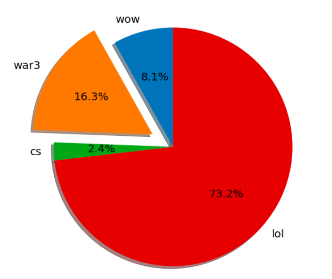

#### [例子2:代码参考](https://my.oschina.net/u/2474629/blog/1787290)

```python
import matplotlib.pyplot as plt
import matplotlib
#print matplotlib.matplotlib_fname()
#字体设置
plt.rcParams['font.family'] = ['Arial Unicode MS']
#用来正常显示负号
plt.rcParams['axes.unicode_minus']=False
label = [u"90分以上",u"80到90",u"70到80",u"60到70",u"60分以下"]
fractions = [8,22,20,34.5,15.5]
explode = (0.1,0,0, 0, 0)
plt.pie(fractions,labels=label,explode=explode,autopct='%1.2f%%')
plt.title("pie")
plt.show()
```

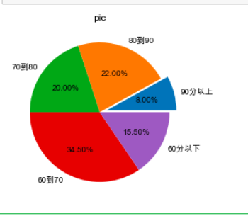

#### [例子3:代码参考](https://www.cnblogs.com/xmcwm/p/11826460.html)

```python
#绘图三部曲：1）创建画布（2）绘图——包含绘图与图形修饰（3）绘图展示
#1.导模块
import matplotlib.pyplot as plt
import numpy as np

#2.创建画布
plt.figure(figsize=(8,8), dpi=120)
#matplotlib默认不支持中文和符号和字符，设置中文和负号
plt.rcParams['font.sans-serif'] = 'Arial Unicode MS'
plt.rcParams['axes.unicode_minus'] = False
#3.绘图
#横轴x和纵轴labels数据
x = [8654.0, 70004.5, 102024.2]
labels = ['第一产业', '第二产业', '第三产业']
#绘制：
colors = ["r", "g", "b"]
autopct = "%.2f%%"
explode = (0.01, 0.02, 0.03)
'''
color：饼图各部分的颜色，labels：饼图各部分的名称，autopct：设置饼图为占比输出，labeldistance：labels显示的位置，shadow：设置阴影，explode：各部分饼尖距离饼图圆心的位置，可以理解为饼图两两之间的缝隙
其他属性设置：pctdistance（占比输出的位置），radius（饼图的半径）
'''
plt.pie(x, explode=explode, labels=labels, colors=colors, autopct=autopct, shadow=True,labeldistance=1.05)
#椭圆饼图变成圆形
plt.axis("equal")
#标题
plt.title("饼图绘制测试")
#增加图例
plt.legend(labels)
#展示出来
plt.show()
#保存图片
plt.savefig("./饼图绘制测试.png")
```

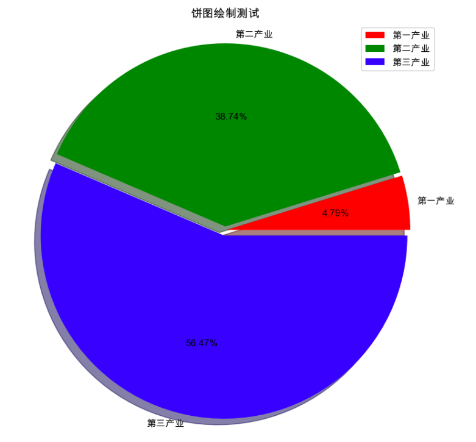

#### [例子4:代码参考](https://www.cnblogs.com/biyoulin/p/9565350.html)

```python
import matplotlib.pyplot as plt
#中文
plt.rcParams['font.sans-serif'] = ['Arial Unicode MS']
#尺寸
plt.rcParams['figure.figsize'] = (8,8)
#分辨率
plt.rcParams['figure.dpi'] = 100
#数据
labels = ['娱乐','育儿','饮食','房贷','交通','其它']
sizes = [2,5,12,70,2,9]
explode = (0,0,0,0.1,0,0)
plt.pie(sizes,explode=explode,labels=labels,autopct='%1.1f%%',shadow=False,startangle=150)
plt.title("饼图示例-8月份家庭支出")
plt.axis('equal')   #该行代码使饼图长宽相等
plt.show()
```

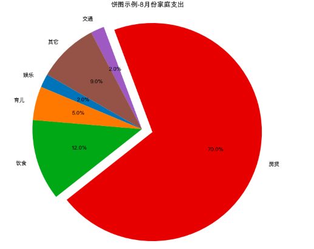

#### [例子5:代码参考](https://www.jb51.net/article/147924.htm)

```python
#代码参考链接：https://www.jb51.net/article/147924.htm
import matplotlib.pyplot as plt 
# 设置绘图的主题风格（不妨使用R中的ggplot分隔）
plt.style.use('ggplot')
# 构造数据
edu = [0.2515,0.3724,0.3336,0.0368,0.0057]
labels = ['中专','大专','本科','硕士','其他']
explode = [0,0.1,0,0,0] # 用于突出显示大专学历人群
colors=['#9999ff','#ff9999','#7777aa','#2442aa','#dd5555'] # 自定义颜色
# 中文乱码和坐标轴负号的处理
plt.rcParams['font.sans-serif'] = ['Microsoft YaHei']
plt.rcParams['axes.unicode_minus'] = False
# 将横、纵坐标轴标准化处理，保证饼图是一个正圆，否则为椭圆
plt.axes(aspect='equal')
# 控制x轴和y轴的范围
plt.xlim(0,4)
plt.ylim(0,4) 
# 绘制饼图
plt.pie(x = edu, # 绘图数据
    explode=explode, # 突出显示大专人群
    labels=labels, # 添加教育水平标签
    colors=colors, # 设置饼图的自定义填充色
    autopct='%.1f%%', # 设置百分比的格式，这里保留一位小数
    pctdistance=0.8, # 设置百分比标签与圆心的距离
    labeldistance = 1.15, # 设置教育水平标签与圆心的距离
    startangle = 180, # 设置饼图的初始角度
    radius = 1.5, # 设置饼图的半径
    counterclock = False, # 是否逆时针，这里设置为顺时针方向
    wedgeprops = {'linewidth': 1.5, 'edgecolor':'green'},# 设置饼图内外边界的属性值
    textprops = {'fontsize':12, 'color':'k'}, # 设置文本标签的属性值
    center = (1.8,1.8), # 设置饼图的原点
    frame = 1 )# 是否显示饼图的图框，这里设置显示 
# 删除x轴和y轴的刻度
plt.xticks(())
plt.yticks(())
# 添加图标题
plt.title('芝麻信用失信用户教育水平分布')
# 显示图形
plt.show()
```


#### 自身利用：搜索及制作所用时间占比图

### 2.气泡图(也可以叫做散点图)

#### [例子1:代码参考](https://blog.csdn.net/sinat_34328764/article/details/80355060)

```python
import matplotlib.pyplot as plt
import numpy as np
x1 = [1, 2, 3, 4]
y1 = [1, 2, 3, 4]     #第一组数据
x2 = [1, 2, 3, 4]
y2 = [2, 3, 4, 5]    #第二组数据
n = 10
x3 = np.random.randint(0, 5, n)
y3 = np.random.randint(0, 5, n)   #使用随机数产生
plt.scatter(x1, y1, marker = 'x',color = 'red', s = 40 ,label = 'First')
# 记号形状   颜色   点的大小 设置标签
plt.scatter(x2, y2, marker = '+', color = 'blue', s = 40, label = 'Second')
plt.scatter(x3, y3, marker = 'o', color = 'green', s = 40, label = 'Third')
plt.legend(loc = 'best')    # 设置 图例所在的位置 使用推荐位置
plt.show()  
```

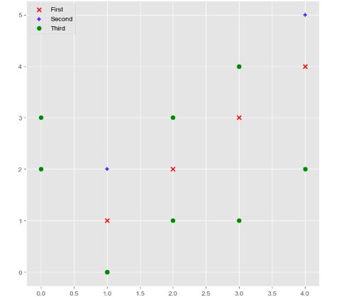

#### [例子2:代码参考](https://www.cnblogs.com/sench/p/9522627.html)

```python
import matplotlib.pyplot as plt
import numpy as np
# 保证图片在浏览器内正常显示
%matplotlib inline

# 10个点
N = 10
x = np.random.rand(N)
y = np.random.rand(N)
s = (30*np.random.rand(N))**2
c = np.random.rand(N)
plt.scatter(x, y, s=s, c=c, marker='^', alpha=0.5)
plt.show()
```

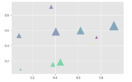

#### [例子3:代码参考](https://www.zhihu.com/question/37146648/answer/299029958)

```python
import numpy as np
import matplotlib.pyplot as plt
# 创建测试数据
x = np.random.randn(20)
y = np.random.randn(20)
# 绘制点
plt.scatter(x, y, s=200, label = '$like$', c = 'blue', marker='.', alpha = None, edgecolors= 'white')
# 用scatter绘制散点图,可调用marker修改点型, label图例用$$包起来表示使用latex公式编辑显示，写\sum符号效果比较明显，普通的符号带上后就变成了斜体，edgecolors边缘颜色，只有前两个是必备参数
x = np.random.randn(10)
y = np.random.randn(10)
plt.scatter(x, y, s=200, label = '$dislike$', c = 'red', marker='.', alpha = None, edgecolors= 'white')
plt.legend()  # 每次都要执行
plt.show()
```

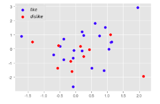

#### [例子4:pt.plot绘制代码参考](https://www.cnblogs.com/cymwill/p/8544758.html)

```python
import numpy as np
import matplotlib.pyplot as plt
X_train = np.array([[1,2,3],[2,3,4],[2,2,1],[3,2,2]])
X_test = np.array([[1,1,1],[2,1,1]])
y_train = np.array([1,1,-1,1])
y_test = np.array([1,-1])
#plt.plot画散点图, 但这个是默认生成折线图的，对线条指定为o的，就成点了；
#plt.plot(X_train[:,0],X_train[:,1],"ro")
X_1, X_0 = X_train[y_train == 1], X_train[y_train == -1]
plt.plot(X_1[:, 0], X_1[:, 1], "ro")
plt.plot(X_0[:, 0], X_0[:, 1], "bo")
plt.show()
```

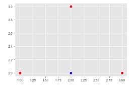

#### [例子5:用plt.scatter绘制代码参考](https://www.cnblogs.com/cymwill/p/8544758.html)

```python
import numpy as np
import matplotlib.pyplot as plt
X_train = np.array([[1,2,3],[2,3,4],[2,2,1],[3,2,2]])
X_test = np.array([[1,1,1],[2,1,1]])
y_train = np.array([1,1,-1,1])
y_test = np.array([1,-1])
#scatter绘制散点图
plt.scatter(X_train[:,0],X_train[:,1])
X_1, X_0 = X_train[y_train == 1], X_train[y_train == -1]
plt.scatter(X_0[:, 0], X_0[:, 1], color="b")
plt.scatter(X_1[:, 0], X_1[:, 1], color="r")
plt.show()
```

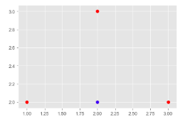

#### [例子6:画三维的散点图代码参考](https://www.cnblogs.com/cymwill/p/8544758.html)

```python
import numpy as np
import matplotlib.pyplot as plt
X_train = np.array([[1,2,3],[2,3,4],[2,2,1],[3,2,2]])
X_test = np.array([[1,1,1],[2,1,1]])
y_train = np.array([1,1,-1,1])
y_test = np.array([1,-1])
#scatter绘制散点图
plt.scatter(X_train[:,0],X_train[:,1])
X_1, X_0 = X_train[y_train == 1], X_train[y_train == -1]
from mpl_toolkits.mplot3d import Axes3D
ax = plt.subplot(111, projection='3d')  # 而且每次画完一个3D图都要这个声明
ax.scatter(X_1[:, 0], X_1[:, 1],X_1[:,2], color="r")
ax.scatter(X_0[:, 0], X_0[:, 1],X_0[:,2], color="b")
plt.show()
```

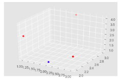

#### 精彩值得看：

[matplotlib——散点图](https://blog.csdn.net/skldecsdn/article/details/79611551)

[使用matplotlib中scatter方法画散点图](https://www.jb51.net/article/158048.htm)

#### 自身利用：搜索及制作所用时间占比图

### 3.雷达图

#### [例子1:代码参考](https://www.cnblogs.com/hhh5460/p/4361610.html)

```python
import numpy as np
import matplotlib.pyplot as plt

#=======自己设置开始============
#标签
labels = np.array(['艺术A','调研I','实际R','常规C','企业E','社会S'])
#数据个数
dataLenth = 6
#数据
data = np.array([1,4,3,6,4,8])
#========自己设置结束============

angles = np.linspace(0, 2*np.pi, dataLenth, endpoint=False)
data = np.concatenate((data, [data[0]])) # 闭合
angles = np.concatenate((angles, [angles[0]])) # 闭合

fig = plt.figure()
ax = fig.add_subplot(111, polar=True)# polar参数！！
ax.plot(angles, data, 'bo-', linewidth=2)# 画线
ax.fill(angles, data, facecolor='r', alpha=0.25)# 填充
ax.set_thetagrids(angles * 180/np.pi, labels, fontproperties="Arial Unicode MS")
ax.set_title("matplotlib雷达图", va='bottom', fontproperties="Arial Unicode MS")
ax.set_rlim(0,10)
ax.grid(True)
plt.show()
```

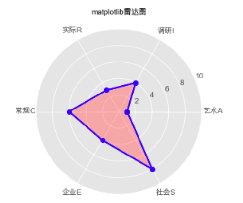

#### [例子2:代码参考](https://blog.csdn.net/yuanxiang01/article/details/79566431)

```python
# encoding: utf-8
import pandas as pd
import numpy as np
import matplotlib.pyplot as plt

plt.rcParams['font.sans-serif'] = ['KaiTi']  # 显示中文
labels = np.array([u'总场次', u'吃鸡数', u'前十数',u'总击杀']) # 标签
dataLenth = 4  # 数据长度
data_radar = np.array([63, 1, 15, 13]) # 数据
angles = np.linspace(0, 2*np.pi, dataLenth, endpoint=False)  # 分割圆周长
data_radar = np.concatenate((data_radar, [data_radar[0]]))  # 闭合
angles = np.concatenate((angles, [angles[0]]))  # 闭合
plt.polar(angles, data_radar, 'bo-', linewidth=1)  # 做极坐标系
plt.thetagrids(angles * 180/np.pi, labels)  # 做标签
plt.fill(angles, data_radar, facecolor='r', alpha=0.25)# 填充
plt.ylim(0, 70)
plt.title(u'Daixiang2018的绝地求生战绩')
plt.show()
```

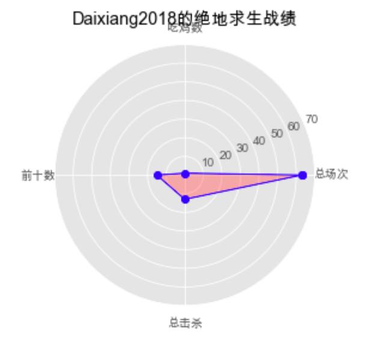

#### [例子3:代码参考](https://www.jb51.net/article/177993.htm)

```python
'''1.空白极坐标图'''
import matplotlib.pyplot as plt
plt.polar()
plt.show()
'''2.绘制一个极坐标点'''
import numpy as np
import matplotlib.pyplot as plt
# 极坐标(0.25*pi,20)
plt.polar(0.25*np.pi, 20, 'ro', lw=2)  # 'ro'红色圆点
plt.ylim(0,50)
plt.show()
'''3.绘制多个极坐标点'''
import numpy as np
import matplotlib.pyplot as plt
theta = np.array([0.25,0.5,0.75,1,1.25,1.5,1.75,2])
r = [75,60,50,70,50,85,45,70]
plt.polar(theta*np.pi, r, 'ro', lw=2)  # 'ro'红色圆点
plt.ylim(0,100)
plt.show()
'''4.链接极坐标点'''
import numpy as np
import matplotlib.pyplot as plt
theta = np.array([0.25,0.5,0.75,1,1.25,1.5,1.75,2])
r = [75,60,50,70,50,85,45,70]
plt.polar(theta*np.pi, r, 'ro-', lw=2)
plt.ylim(0,100)
plt.show()
'''5.闭合链接极坐标点'''
import numpy as np
import matplotlib.pyplot as plt
# 只需在末尾添加一个和起始点重合的点
theta = np.array([0.25,0.5,0.75,1,1.25,1.5,1.75,2,0.25])
r = [75,60,50,70,50,85,45,70, 75]
plt.polar(theta*np.pi, r, 'ro-', lw=2)
plt.ylim(0,100)
plt.show()
'''6.填充颜色'''
import numpy as np
import matplotlib.pyplot as plt
# 只需在末尾添加一个和起始点重合的点
theta = np.array([0.25,0.5,0.75,1,1.25,1.5,1.75,2,0.25])
r = [75,60,50,70,50,85,45,70, 75]
plt.polar(theta*np.pi, r, 'ro-', lw=2)
plt.fill(theta*np.pi, r, facecolor='r', alpha=0.5) # 填充
plt.ylim(0,100)
plt.show()
'''7.绘制成绩雷达图'''
import numpy as np
import matplotlib.pyplot as plt
courses = ['C++', 'Python', 'Java', 'C', 'C#', 'Go', 'Matlab']
scores = [82,100,90,78,40,66,88]
datalength = len(scores)
angles = np.linspace(0, 2*np.pi, datalength, endpoint=False)  # 均分极坐标
scores.append(scores[0])  # 在末尾添加第一个值，保证曲线闭合
angles = np.append(angles, angles[0])
plt.polar(angles, scores, 'rv-', lw=2)
plt.thetagrids(angles*180/np.pi, courses, fontproperties='Arial Unicode MS')
plt.fill(angles, scores, facecolor='r', alpha=0.4)
```

#### 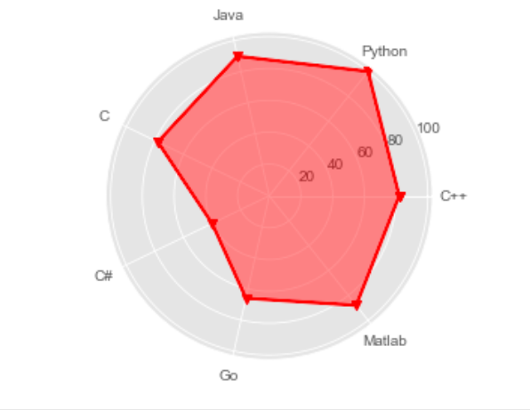[例子4:绘制多个雷达图代码参考](https://www.jb51.net/article/177993.htm)

```python
#参考链接：https://www.cnblogs.com/changfan/p/11799721.html
import numpy as np
import matplotlib.pyplot as plt
# 中文和负号的正常显示
plt.rcParams['font.sans-serif'] = 'Microsoft YaHei'
plt.rcParams['axes.unicode_minus'] = False
#使用ggplot的风格绘图
plt.style.use('ggplot')
#构造数据
values = [3.2,2.1,3.5,2.8,3,4]
values_1 = [2.4,3.1,4.1,1.9,3.5,2.3]
feature = ['个人能力','QC知识',"解决问题能力","服务质量意识","团队精神","IQ"]
N = len(values)
#设置雷达图的角度，用于平分切开一个平面
angles = np.linspace(0,2*np.pi,N,endpoint=False)
#使雷达图封闭起来
values = np.concatenate((values,[values[0]]))
angles = np.concatenate((angles,[angles[0]]))
values_1 = np.concatenate((values_1,[values_1[0]]))
#绘图
fig = plt.figure()
#设置为极坐标格式
ax = fig.add_subplot(111, polar=True)
#绘制折线图
ax.plot(angles,values,'o-',linewidth=2,label='活动前')
ax.fill(angles,values,'r',alpha=0.5)
#填充颜色
ax.plot(angles,values_1,'o-',linewidth=2,label='活动后')
ax.fill(angles,values_1,'b',alpha=0.5)
#添加每个特质的标签
ax.set_thetagrids(angles*180/np.pi,feature)
#设置极轴范围
ax.set_ylim(0,5)
#添加标题
plt.title('活动前后员工状态')
#增加网格纸
ax.grid(True)
plt.show()
```

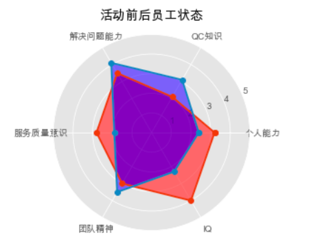

#### [例子5:代码参考](https://www.matplotlib.org.cn/gallery/specialty_plots/radar_chart.html)

```python
import numpy as np
import matplotlib.pyplot as plt
from matplotlib.path import Path
from matplotlib.spines import Spine
from matplotlib.projections.polar import PolarAxes
from matplotlib.projections import register_projection

def radar_factory(num_vars, frame='circle'):
    """Create a radar chart with `num_vars` axes.

    This function creates a RadarAxes projection and registers it.

    Parameters
    ----------
    num_vars : int
        Number of variables for radar chart.
    frame : {'circle' | 'polygon'}
        Shape of frame surrounding axes.

    """
    # calculate evenly-spaced axis angles
    theta = np.linspace(0, 2*np.pi, num_vars, endpoint=False)

    def draw_poly_patch(self):
        # rotate theta such that the first axis is at the top
        verts = unit_poly_verts(theta + np.pi / 2)
        return plt.Polygon(verts, closed=True, edgecolor='k')

    def draw_circle_patch(self):
        # unit circle centered on (0.5, 0.5)
        return plt.Circle((0.5, 0.5), 0.5)

    patch_dict = {'polygon': draw_poly_patch, 'circle': draw_circle_patch}
    if frame not in patch_dict:
        raise ValueError('unknown value for `frame`: %s' % frame)

    class RadarAxes(PolarAxes):

        name = 'radar'
        # use 1 line segment to connect specified points
        RESOLUTION = 1
        # define draw_frame method
        draw_patch = patch_dict[frame]

        def __init__(self, *args, **kwargs):
            super().__init__(*args, **kwargs)
            # rotate plot such that the first axis is at the top
            self.set_theta_zero_location('N')

        def fill(self, *args, closed=True, **kwargs):
            """Override fill so that line is closed by default"""
            return super().fill(closed=closed, *args, **kwargs)

        def plot(self, *args, **kwargs):
            """Override plot so that line is closed by default"""
            lines = super().plot(*args, **kwargs)
            for line in lines:
                self._close_line(line)

        def _close_line(self, line):
            x, y = line.get_data()
            # FIXME: markers at x[0], y[0] get doubled-up
            if x[0] != x[-1]:
                x = np.concatenate((x, [x[0]]))
                y = np.concatenate((y, [y[0]]))
                line.set_data(x, y)

        def set_varlabels(self, labels):
            self.set_thetagrids(np.degrees(theta), labels)

        def _gen_axes_patch(self):
            return self.draw_patch()

        def _gen_axes_spines(self):
            if frame == 'circle':
                return super()._gen_axes_spines()
            # The following is a hack to get the spines (i.e. the axes frame)
            # to draw correctly for a polygon frame.

            # spine_type must be 'left', 'right', 'top', 'bottom', or `circle`.
            spine_type = 'circle'
            verts = unit_poly_verts(theta + np.pi / 2)
            # close off polygon by repeating first vertex
            verts.append(verts[0])
            path = Path(verts)

            spine = Spine(self, spine_type, path)
            spine.set_transform(self.transAxes)
            return {'polar': spine}

    register_projection(RadarAxes)
    return theta


def unit_poly_verts(theta):
    """Return vertices of polygon for subplot axes.

    This polygon is circumscribed by a unit circle centered at (0.5, 0.5)
    """
    x0, y0, r = [0.5] * 3
    verts = [(r*np.cos(t) + x0, r*np.sin(t) + y0) for t in theta]
    return verts


def example_data():
    # The following data is from the Denver Aerosol Sources and Health study.
    # See doi:10.1016/j.atmosenv.2008.12.017
    #
    # The data are pollution source profile estimates for five modeled
    # pollution sources (e.g., cars, wood-burning, etc) that emit 7-9 chemical
    # species. The radar charts are experimented with here to see if we can
    # nicely visualize how the modeled source profiles change across four
    # scenarios:
    #  1) No gas-phase species present, just seven particulate counts on
    #     Sulfate
    #     Nitrate
    #     Elemental Carbon (EC)
    #     Organic Carbon fraction 1 (OC)
    #     Organic Carbon fraction 2 (OC2)
    #     Organic Carbon fraction 3 (OC3)
    #     Pyrolized Organic Carbon (OP)
    #  2)Inclusion of gas-phase specie carbon monoxide (CO)
    #  3)Inclusion of gas-phase specie ozone (O3).
    #  4)Inclusion of both gas-phase species is present...
    data = [
        ['Sulfate', 'Nitrate', 'EC', 'OC1', 'OC2', 'OC3', 'OP', 'CO', 'O3'],
        ('Basecase', [
            [0.88, 0.01, 0.03, 0.03, 0.00, 0.06, 0.01, 0.00, 0.00],
            [0.07, 0.95, 0.04, 0.05, 0.00, 0.02, 0.01, 0.00, 0.00],
            [0.01, 0.02, 0.85, 0.19, 0.05, 0.10, 0.00, 0.00, 0.00],
            [0.02, 0.01, 0.07, 0.01, 0.21, 0.12, 0.98, 0.00, 0.00],
            [0.01, 0.01, 0.02, 0.71, 0.74, 0.70, 0.00, 0.00, 0.00]]),
        ('With CO', [
            [0.88, 0.02, 0.02, 0.02, 0.00, 0.05, 0.00, 0.05, 0.00],
            [0.08, 0.94, 0.04, 0.02, 0.00, 0.01, 0.12, 0.04, 0.00],
            [0.01, 0.01, 0.79, 0.10, 0.00, 0.05, 0.00, 0.31, 0.00],
            [0.00, 0.02, 0.03, 0.38, 0.31, 0.31, 0.00, 0.59, 0.00],
            [0.02, 0.02, 0.11, 0.47, 0.69, 0.58, 0.88, 0.00, 0.00]]),
        ('With O3', [
            [0.89, 0.01, 0.07, 0.00, 0.00, 0.05, 0.00, 0.00, 0.03],
            [0.07, 0.95, 0.05, 0.04, 0.00, 0.02, 0.12, 0.00, 0.00],
            [0.01, 0.02, 0.86, 0.27, 0.16, 0.19, 0.00, 0.00, 0.00],
            [0.01, 0.03, 0.00, 0.32, 0.29, 0.27, 0.00, 0.00, 0.95],
            [0.02, 0.00, 0.03, 0.37, 0.56, 0.47, 0.87, 0.00, 0.00]]),
        ('CO & O3', [
            [0.87, 0.01, 0.08, 0.00, 0.00, 0.04, 0.00, 0.00, 0.01],
            [0.09, 0.95, 0.02, 0.03, 0.00, 0.01, 0.13, 0.06, 0.00],
            [0.01, 0.02, 0.71, 0.24, 0.13, 0.16, 0.00, 0.50, 0.00],
            [0.01, 0.03, 0.00, 0.28, 0.24, 0.23, 0.00, 0.44, 0.88],
            [0.02, 0.00, 0.18, 0.45, 0.64, 0.55, 0.86, 0.00, 0.16]])
    ]
    return data


if __name__ == '__main__':
    N = 9
    theta = radar_factory(N, frame='polygon')

    data = example_data()
    spoke_labels = data.pop(0)

    fig, axes = plt.subplots(figsize=(9, 9), nrows=2, ncols=2,
                             subplot_kw=dict(projection='radar'))
    fig.subplots_adjust(wspace=0.25, hspace=0.20, top=0.85, bottom=0.05)

    colors = ['b', 'r', 'g', 'm', 'y']
    # Plot the four cases from the example data on separate axes
    for ax, (title, case_data) in zip(axes.flatten(), data):
        ax.set_rgrids([0.2, 0.4, 0.6, 0.8])
        ax.set_title(title, weight='bold', size='medium', position=(0.5, 1.1),
                     horizontalalignment='center', verticalalignment='center')
        for d, color in zip(case_data, colors):
            ax.plot(theta, d, color=color)
            ax.fill(theta, d, facecolor=color, alpha=0.25)
        ax.set_varlabels(spoke_labels)

    # add legend relative to top-left plot
    ax = axes[0, 0]
    labels = ('Factor 1', 'Factor 2', 'Factor 3', 'Factor 4', 'Factor 5')
    legend = ax.legend(labels, loc=(0.9, .95),
                       labelspacing=0.1, fontsize='small')

    fig.text(0.5, 0.965, '5-Factor Solution Profiles Across Four Scenarios',
             horizontalalignment='center', color='black', weight='bold',
             size='large')

    plt.show()
```

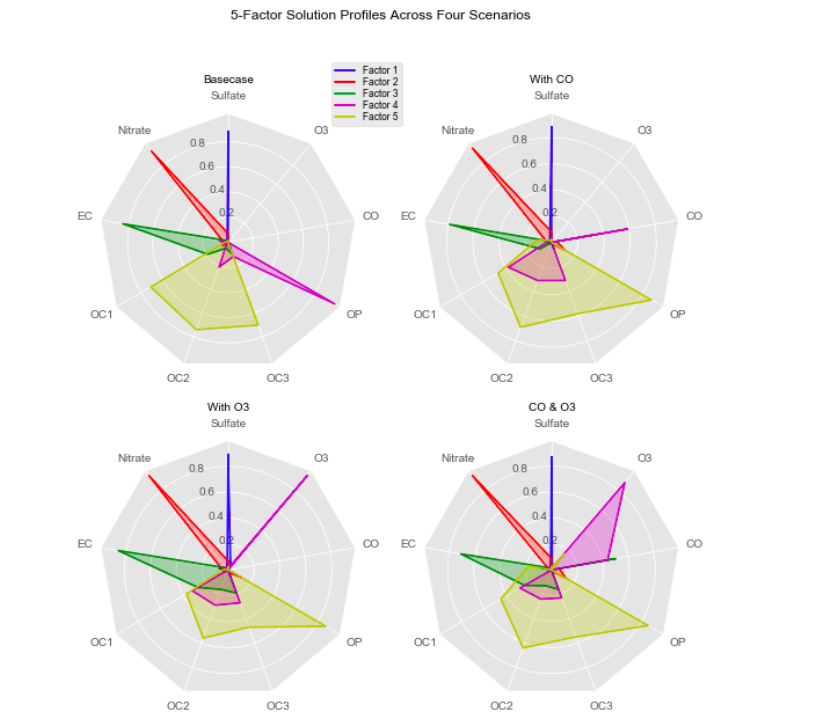


### 4.K线图

[]()

```python

```


[]()

```python

```


[]()

```python

```

#### 精彩值得看：

[Matplotlib绘制金融K线图](https://www.jianshu.com/p/31edfcebbd96)

[利用matplotlib.finance绘制K线图时使用关键要点：](https://www.jianshu.com/p/a4b6e1d7ce94)

```python
#绘制k线图的核心语句是：
import matplotlib.finance as mpf
mpf.candlestick_ochl( ax, matrix_data, colorup=***, colordown=***)
```

[一步一步教你用Python画出专业的K线图](https://zhuanlan.zhihu.com/p/29519040)

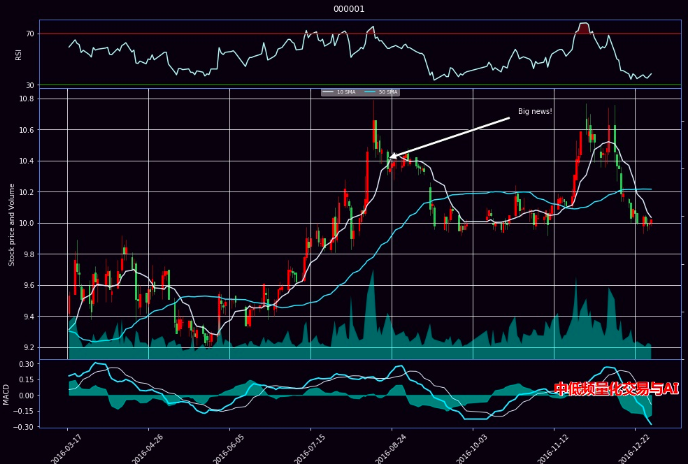

[金融数据找不到？那是你没见识到joinquant的利器——JQData](https://www.lizenghai.com/archives/1047.html)

[*jqdatasdk是提供给用户获取聚宽金融数据的SDK。*](https://pypi.org/project/jqdatasdk/1.5.6/)


### 3D曲线图

```python
#参考链接：https://www.jb51.net/article/177993.htm
'''1.绘制三维曲线，并设置图例字号'''
import matplotlib.pyplot as plt
import numpy as np
import matplotlib as mpl
import matplotlib.font_manager as fm
from mpl_toolkits.mplot3d import Axes3D # 不可缺少
fig = plt.figure()
ax = fig.gca(projection='3d')  # 设置图像属性
# 测试数据
theta = np.linspace(-4 * np.pi, 4*np.pi, 100)
z = np.linspace(-4,4,100) * 0.3
r = z**4 + 1
x = r*np.sin(theta)
y = r*np.cos(theta)
ax.plot(x,y,z,'b^-', label='3D 测试曲线')
# 设置图例的字体，字号
font = fm.FontProperties('simhei')
mpl.rcParams['legend.fontsize'] = 10
ax.legend(prop=font)
plt.show()
```

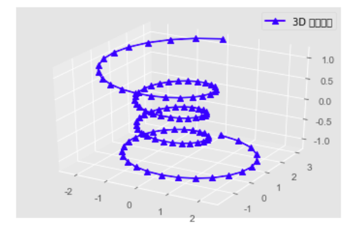

### 3D柱状图

```python
#参考链接：https://www.jb51.net/article/177993.htm  
'''2.绘制三维柱状图，并每个柱子颜色随机'''
import numpy as np
import matplotlib.pyplot as plt
import mpl_toolkits.mplot3d
x = np.random.randint(0,40,10)
y = np.random.randint(0,40,10)
z = 80*abs(np.sin(x+y))
ax = plt.subplot(projection='3d')
for xx, yy, zz in zip(x,y,z):
  color = np.random.random(3)
  ax.bar3d(xx, yy, 0, dx=1, dy=1, dz=zz, color=color)
ax.set_xlabel('X轴', fontproperties='Arial Unicode MS')
ax.set_ylabel('Y轴', fontproperties='Arial Unicode MS')
ax.set_zlabel('Z轴', fontproperties='Arial Unicode MS')
plt.show()
```

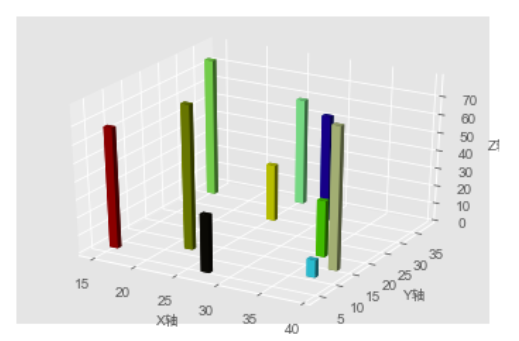


