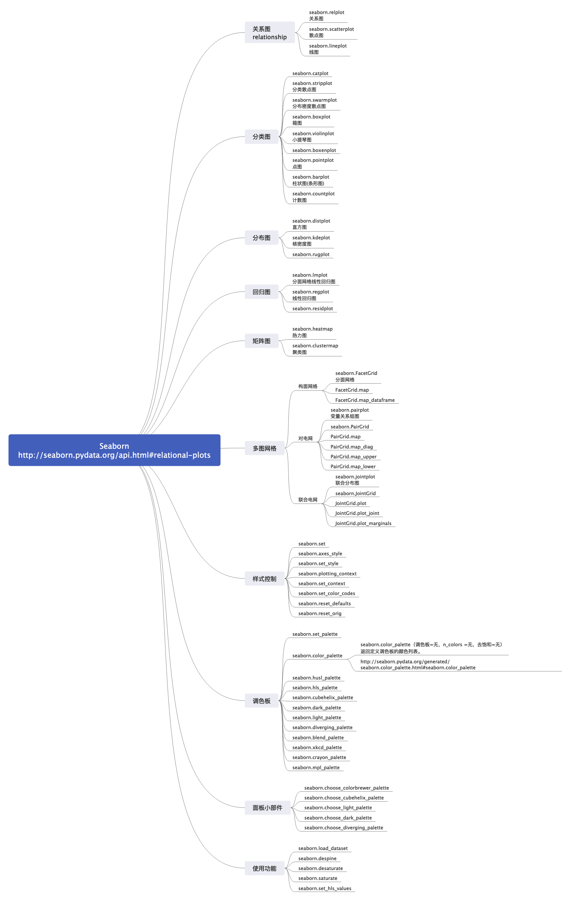

# 待补充

### 1. 柱状图

### 2. 箱图

### 3. 小提琴图

### 4. 分类散布图

### 5. 分类两面网格图

### 6. 关联散布图

### 7. 关联线图

### 8. 散布图矩阵

### 10. 分面网格关联图

### 11. 分布图

### 12. 联合图

### 13. 热力图

### 14. 线性回归图

### 15. 分面网格图

